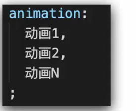

## 位移

transform:translate(x px,y px) 位移，x轴方向和y轴方向

配合transition完成过渡效果

单方向 translateX() translateY()

借助translate完成盒子居中效果  translate(50%,50%)移动距离为**自身长度**的50%

## 旋转

transform:rotate(角度) 单位**deg**

**转换原点**

transform-origin

## 多重转换

**多形态转换**，例：平移+旋转

## 放大缩小

transform:scale（）

用scale不会改变长宽，取值<1为缩小, 大于1则是放大相应倍数

opacity设置透明度，取值0-1

## 渐变背景

transparent 透明

## 空间转换

Z轴表现，近大远小，需配合**perspective**属性才能看到效果

#### 透视(视距，模拟眼睛到屏幕的距离，配合translateZ实现近大远小)

**perspective** 属性

## 空间旋转

rotateZ （延Z轴转，和rotate()效果相同）

rotateX  （同样设置视距，perspective 旋转效果更好看）

rotateY

rotate3d(x,y,z) x,y,z取值为0-1

## 立体呈现

transform-style:preserve-3d

## 空间-缩放

## 动画

速度曲线 : 匀速：linear  分步： steps(n)  

重复次数：infinite 无限循环

动画方向：alternate 可让动画带有反向效果(完成正向变化后原路退回)

执行完毕时状态：初始状态：backwards     最终状态：forwards

 

多组动画

