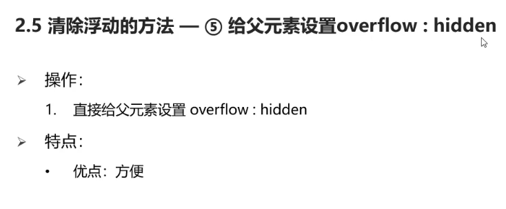
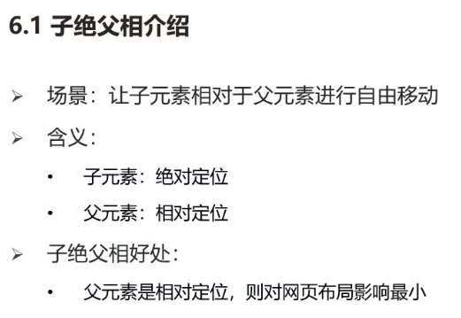
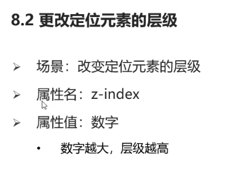
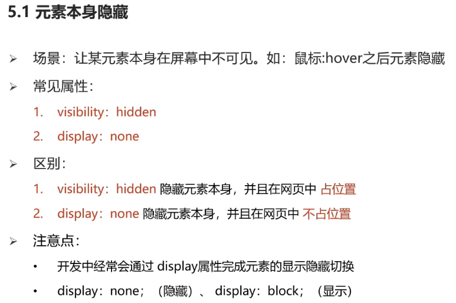
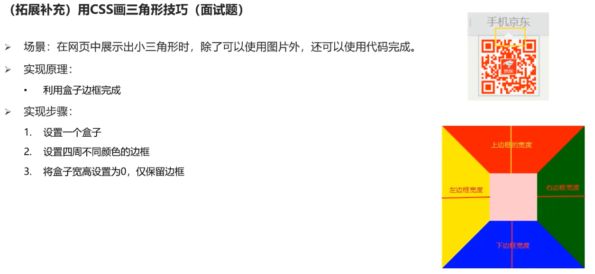
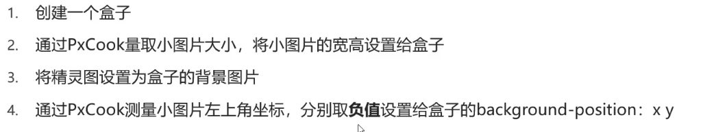

# **HTML标签**

双标签()，单标签

\
 分割线 \ 换行 (单标签)

\<strong>加粗 

\<ins>下划线 

\<em>倾斜 

\<del>删除线

**\<image>**  **alt** 属性，当图片加载失败时显示的文本，**width**和**height**只设置其中一个，是等比例放大/缩小

title属性，提示文本，鼠标悬停时显示

\<audio>音频标签，controls属性:显示播放控件 ,autoplay自动播放 ,loop循环播放 

\<video>视频标签，muted属性，静音播放

\<a> target属性，target=“_self” 默认值，当前页面跳转，\_blank新建页面跳转

**无序列表**

\<ul>\<li>\</li>\</ul> 以小圆点开头，type属性有disc（实心圆默认）、circle（空心圆）、square（实心正方形）、none（取消前缀）

**有序列表**

\<ol>\<li>\</li>\</ol> 以数字1、2、3、开头。有序列表有两个属性，分别是type和start。 type有五个属性值：1、a、A、i、I(罗马数字)，用来表示列表前缀的样式。start表示从type类型的第几个数字开始，比如当type=“a”，start=“4”，指选择的是小写字母类型，从第四个字母d开始列举。

**自定义列表**

\<dl>标签可以定义描述列表，\<dl>和\<dd>一起使用，创建自定义列表（描述列表）。

**表格**

\<table>     属性：border=“ ” width=“ ” height=“”
    <tr>
        <td></td>
    </tr>
\</table>

**带表格标题和表头单元格** 

th替换td，作为表头

\<table>  

   \<caption>表格大标题\</caption>   

​    <tr>
​         \<th>表头单元格\</th> 有加粗效果

​         \<th>表头单元格\</th>

​    </tr>

​     <tr>
​         \<td>表格内容\</td>

​         \<td>表格内容\</td>

​       </tr>

\</table>

还有 表格**结构标签**\<thead>表示表格头部  \<tbody>表格主体  \<tfoot>表格底部，包裹在\<tr>外部，

可省略，让代码更清晰

**合并单元格**

左上原则(左右合并留左，上下合并留上) 同一结构标签内容才能合并

\<td rowspan="" colspan=""> rowspan行合并(上下合并)，colspan列合并(左右合并)

input 单标签

\<input type="text"  "radio" "password" "checkbox" "file"> placeholder 提示信息

**单选框radio**

\<input type="**radio**" name=""> 用name属性进行分组，同一组内只能**单选**，**checked**属性：默认选中

**多选框checkbox**

\<input type="**checkbox**" name="">

**文件选择 file**

\<input type="**file**" multiple>

**input--button**

type: submit 提交  , reset重置 ,   button 无功能,可配合js。type=“button”时，用value控制按钮文本

用form标签包裹button

**下拉菜单**

\<select>

   \<option>   \</option>  selected:默认选中

\<select>

 **textarea文本域**标签

cols rows属性控制宽度行数

**lable标签**

将input标签和文字绑定，点击文字就能选中复选框

**没有语义的布局标签 div span**

div独占一行 span一个可以有多个

**空格合并现象**

代码中多个空格，只显示一个。使用**字符实体**，结构：&英文;

空格 & nbsp;

小于号＜ & lt；

大于号＞ & gt;

**有语义的布局标签**

# **CSS**

写进\标签（head标签中）

三种引用方式：内嵌式、外联式、行内式

\<link rel="stylesheet" href="">

### **选择器**

#### **标签选择器**：例：p{} div{}

#### **类（class属性）选择器**：.类名{} 

#### **id（id属性）选择器**：#id名{}

#### **通配符选择器**：*{} 全部标签生效

**font-size** 大小(px)         **font-weight** 粗细(值：100-900 整百数，无单位)

**font-style**   font-style:italic 倾斜                加粗 颜色 

font-family 字体 ，字体系列：无衬线字体(没有笔锋),衬线字体(有笔锋，粗细不均) ，等宽字体(每个字母大小相同，编程字体)

**font-family**：具体字体,字体系列            字体有多个单词，用引号包裹

**样式的层叠问题**

覆盖显示

#### **font属性连写**

因为在连写中，省略了相关值，会设置为默认值，写在连写上面会被覆盖。

#### **文本缩进**

**text-indent**:（em或px，1em即1个字）2em；

#### **文本修饰**

text-decoration 

#### **水平对齐**

#### **文字水平居中**

text-align 文字水平居中，line-height垂直居中(设置高度和盒子高度一直即可以垂直居中)

只对行内元素和行内块元素有用

**盒子水平居中** **margin：0 auto**

#### **行高**

**line-height**

控制行间距，取值：数字+px / 倍数(当前font-size的倍数)    单行文本文字上间距到下间距的距离

可加入font连写，同时如果存在font连写时，单独写需要写在连写下方(覆盖问题)

#### **常见颜色取值RGB**

rgb三原色，红绿蓝，每项取值0~255

**rgba**，a表示透明度，a的取值范围 0~1 （0为完全透明）

**十六进制表示法**（类似rgb红绿蓝表示法，只是用**十六进制数**代替数字）

## 选择器进阶

#### **后代选择器**

选择器1 选择器2{css} 用空格隔开 

后代包括儿子，孙子，重孙子

#### **子代选择器：>**

选择器1 > 选择器2{css}

找到选择器1的子代标签，只包括"儿子"

#### **并集选择器**，同时选择多组标签，设置相同样式

选择器1 ，选择器2 {css} 通过，分隔

#### **交集选择器：紧挨着**

选中页面中同时满足多个选择器的标签

 选择器1选择器2{css} 中间无空格，紧挨着

如果有**标签选择器，必须写在最前面**

#### **hover伪类选择器**

选择器:hover{css} （其实相当于交集选择器,紧挨着）

ps:**伪类**：同一个标签，根据其**不同的种状态，有不同的样式**。这就叫做“伪类”。伪类用冒号来表示。

比如div是属于box类，这一点很明确，就是属于box类。但是a属于什么类？不明确。因为需要看用户点击前是什么状态，点击后是什么状态。所以，就叫做“伪类”。

##### 静态伪类和动态伪类

伪类选择器分为两种。

（1）**静态伪类**：只能用于**超链接**的样式。如下：

- `:link` 超链接点击之前
- `:visited` 链接被访问过之后

PS：以上两种样式，只能用于超链接。

（2）**动态伪类**：针对**所有标签**都适用的样式。如下：

- `:hover` “悬停”：鼠标放到标签上的时候

- `:active` “激活”： 鼠标点击标签，但是不松手时。

- `:focus` 是某个标签获得焦点时的样式（比如某个输入框获得焦点）

  ##### 超链接的四种状态

  a标签有4种伪类（即对应四种状态），要求背诵。如下：

  - `:link` “链接”：超链接点击之前
  - `:visited` “访问过的”：链接被访问过之后
  - `:hover` “悬停”：鼠标放到标签上的时候
  - `:active` “激活”： 鼠标点击标签，但是不松手时。

记住，在css中，这四种状态**必须按照固定的顺序写**：

> a:**l**ink 、a:visited 、a:hover 、a:active

如果不按照顺序，那么将失效。“爱恨准则”：love hate。必须先爱，后恨。

问：既然`a{}`定义了超链的属性，和`a:link{}`定义了超链点击之前的属性，那这两个有啥区别呢？

答：

**`a{}`和`a:link{}`的区别：**

- `a{}`定义的样式针对所有的超链接(包括锚点，锚点:页面元素之间跳转)

- `a:link{}`定义的样式针对所有写了href属性的超链接(不包括锚点)

  在写`a:link`、`a:visited`这两个伪类的时候，要么同时写，要么同时不写。如果只写`a`属性和`a:link`属性，不规范。(link和visited可以省略，简写在a标签里面)

#### **背景相关属性**

background-color

background-image:url();

#### **背景平铺**

background-repeat

默认会平铺(图片大小不够时，会有多张相同图片铺满div)

#### **背景位置**

background-position:水平方向位置 垂直方向位置

## **元素显示模式**

#### **块级元素**   display属性值为block 即为块级元素

#### **行内元素(行内非替换元素)**

#### **行内块元素(行内替换元素，如img，input等)**

行内元素不可包含div等，a标签比较特殊，可以包含div

（替换理解为内容不固定如img input select）行内非替换元素不可设置宽高

ps：行内块元素能一行显示多个,但标签换行后,换行空白部分相当于一个空格(空格合并现象),**每个元素之间会有小间隙**

####  **元素显示模式转换**

修改display属性

## CSS三大特性

#### **继承性**：子元素有默认继承父元素样式的特点

继承失效

#### **层叠性**

#### **优先级**

行内样式，指之间写在标签内的样式

important用法

#### **权重叠加计算**

注：**多个复合选择器比较时,例：id选择器个数，A=B＞C 则继续比较A和B的类选择器个数,C不会再比较,即使C的类选择器个数更多**

注：**全是继承时**,优先继承直接父元素的样式

## **调试工具查错流程**

## 盒子模型

#### **border连写**

**单方向**

#### **padding取值**

上开始，顺时针，无则看对面

#### **padding单方向设置**

padding-top padding-bottom padding-left padding-right

#### **CSS3盒模型(自动内减)**

设置了border边框,盒子大小会被撑大(css设置的盒子大小+边框大小)

使用css3   **box-sizing：border-box**

**ps：设置padding值，是直接给盒子宽度或高度增加相应值(标准盒子)(会撑大盒子)，同样需要设置box-sizing实现自动内减**

#### **外边距折叠现象-合并现象**

(行内块元素,设置左右边距,两者不会合并)

#### **外边距折叠现象-塌陷现象**

只有互相嵌套的块元素会出现

 (将父子元素分隔开,不紧贴在一起,所以设置boder或者padding都可以)

**设置overflow,或者行内块,或者浮动,之所以能解决塌陷现象，是因为他们都让盒子进入了BFC模式。**
**而BFC 会阻止外边距折叠**

##### 什么是BFC模式

**BFC(Block Fomatting Context)**为块级格式化上下文的的简称。实质上可以理解为盒子内部一套自己的渲染规则，而这种渲染规则会影响着元素的定位以及与其兄弟元素之间的相互作用。一般当我们进行盒子布局的时候，形成**BFC**模式的盒子就会按自己的渲染规则布局和定位而不影响其他环境中的布局（常见的浮动元素脱离标准文档流，其内部子元素则按照其相应的渲染规则布局，而浮动元素之间则互不影响，其自身就像一个独立的容器）。

 **总结一下也就是说：如果一个元素符合了成为BFC模式的条件，该元素内部元素的布局和定位就和外部元素互不影响(除非内部的盒子建立了新的 BFC)，是一个隔离了的独立容器，拥有自己的渲染规则。（在 CSS3 中，BFC 叫做 Flow Root）**

##### 二、形成BFC模式的条件

float的值不为none
 overflow值不为visible
 position值不为static / relative
 display的值为table-cell，table-caption， inline-block中的任何一个

#### 行内元素的margin和padding无效情况

#### 不会撑大盒子的特殊情况

(父元素限制了宽度,子元素设置border或padding会自动内减，仅限于左右宽度,上下仍会撑大)

## 结构伪类选择器

 

ps:不带E也可，就只匹配父元素中的元素

#### 结构伪类选择器扩展补充

ps:  nth-child在数个数时，不会排除其他同级非E的子元素，需要满足子元素为E，且所在位置为第n

​       nth-of-type，只会数元素为E的子元素个数,比较灵活

## 伪元素

ps:    ::前加父元素  必须设置content属性, 如：content:‘我是一个伪元素’

**伪元素默认是行内元素，需要设置宽高的话** display：block

### 浮动

浮动的特点

ps:不能让元素水平居中，但可以设置元素的内容在元素中居中

#### **清楚浮动**

#### 清除浮动的方法

## 定位

#### 相对定位

ps:**原位置占位**

#### 绝对定位

#### 绝对定位相对于谁进行偏移？

#### 子绝父相

父元素用相对定位，在页面标准流布局中有占位，不会使后续排版变乱

**子盒子往左移动自己的一半 transform：translateX（-50%）**

transform：translate(-50%,-50%) X代表横坐标，用该方法表示X,Y方向都设置居中

#### 固定定位

#### 不同定位元素层级关系

相对、绝对、固定定位写在下面的元素层级更高(默认相同)

#### 更改定位元素的层级

**z-index**

### 垂直对齐方式(基线对齐，顶部、中部、底部对齐)

基线

vertical-align，解决行内元素或行内块元素的对齐问题(块元素一行显示一个，不需要设置，该设置对块元素无用)

**解决方式二：设置浮动，浮动元素没有垂直对齐方式的问题**

#### vertical-align可以解决的问题

ps:5.父元素设置line-height后，由于图片和文字默认基线对齐，还需要给img标签设置vertical-align：middle

### 光标类型

设置鼠标光标在元素上时显示的样式

### 边框圆角

边框圆角常见应用

### 溢出部分显示效果

### 元素隐藏

### 元素整体透明度

### 边框合并

### 选择器扩展（链接伪类选择器，焦点伪类选择器，属性选择器）

#### 链接伪类选择器

#### 用css画三角形

四个边框都设置时，边框形状为梯形，**盒子宽高设为0时，变为4个三角形**

#### 画任意三角形

调整不同边框的宽度

#### 焦点伪类选择器

#### 属性选择器

## 补充

#### 精灵图使用步骤

**为什么是”负值“？**如图，需要将图片进行移动，展示(0,0)坐标图片，x,y相当于图片左上角坐标，所以取量取结果的负值

#### 背景图大小设置

**background连写**

#### 过渡

单独设置多组

ps:  **transition：all** 设置all属性，若设置了padding，也**会将padding过程展示出来**，想不展示可以单独设置其他属性

**有语义的布局标签**

**版心**

**书写顺序**

##### 文字阴影

4个值

**盒子阴影**

