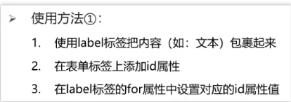
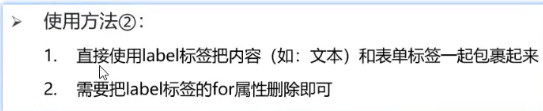

**HTML标签**

双标签()，单标签

\
 分割线 \ 换行 (单标签)

\<strong>加粗 

\<ins>下划线 

\<em>倾斜 

\<del>删除线

**\<image>**  **alt** 属性，当图片加载失败时显示的文本，**width**和**height**只设置其中一个，是等比例放大/缩小

title属性，提示文本，鼠标悬停时显示

\<audio>音频标签，controls属性:显示播放控件 ,autoplay自动播放 ,loop循环播放 

\<video>视频标签，muted属性，静音播放

\<a> target属性，target=“_self” 默认值，当前页面跳转，\_blank新建页面跳转

**无序列表**

\<ul>\<li>\</li>\</ul> 以小圆点开头，type属性有disc（实心圆默认）、circle（空心圆）、square（实心正方形）、none（取消前缀）

**有序列表**

\<ol>\<li>\</li>\</ol> 以数字1、2、3、开头。有序列表有两个属性，分别是type和start。 type有五个属性值：1、a、A、i、I(罗马数字)，用来表示列表前缀的样式。start表示从type类型的第几个数字开始，比如当type=“a”，start=“4”，指选择的是小写字母类型，从第四个字母d开始列举。

**自定义列表**

\<dl>标签可以定义描述列表，\<dl>和\<dd>一起使用，创建自定义列表（描述列表）。

**表格**

\<table>     属性：border=“ ” width=“ ” height=“”
    <tr>
        <td></td>
    </tr>
\</table>

**带表格标题和表头单元格** 

th替换td，作为表头

\<table>  

   \<caption>表格大标题\</caption>   

​    <tr>
​         \<th>表头单元格\</th>

​         \<th>表头单元格\</th>

​    </tr>

​     <tr>
​         \<td>表格内容\</td>

​         \<td>表格内容\</td>

​       </tr>

\</table>

还有 表格**结构标签**\<thead>表示表格头部  \<tbody>表格主体  \<tfoot>表格底部，包裹在\<tr>外部，

可省略，让代码更清晰

**合并单元格**

左上原则(左右合并留左，上下合并留上) 同一结构标签内容才能合并

\<td rowspan="" colspan=""> rowspan横向合并，colspan纵向

input 单标签

\<input type="text"  "radio" "password" "checkbox" "file"> placeholder 提示信息

**单选框radio**

\<input type="**radio**" name=""> 用name属性进行分组，同一组内只能**单选**，**checked**属性：默认选中

**多选框checkbox**

\<input type="**checkbox**" name="">

**文件选择 file**

\<input type="**file**" multiple>

**input--button**

type: submit 提交 reset重置 button 无功能,可配合js。type=“button”时，用value控制按钮文本

用form标签包裹button

**下拉菜单**

\<select>

   \<option>   \</option>  selected:默认选中

\<select>

 **textarea文本域**标签

cols rows属性控制宽度行数

**lable标签**

将input标签和文字绑定，点击文字就能选中复选框

**没有语义的布局标签 div span**

div独占一行 span一个可以有多个

