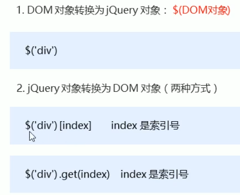
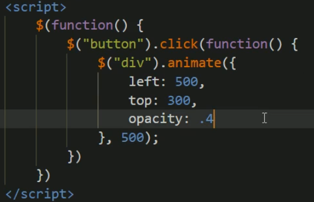
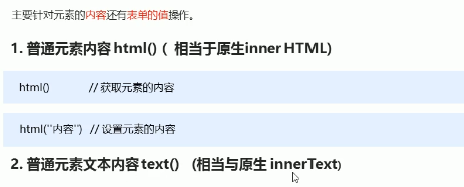
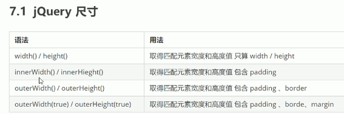
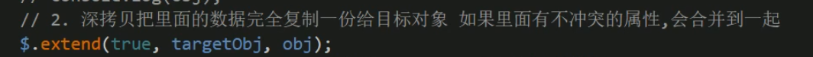

#### 等待页面加载完成

#### jQuery对象

#### jQuery对象和Dom对象互相转换

#### jQuery基础选择器

#### jQuery隐式迭代

#### jQuery筛选选择器

#### mouseover()   mouseout() show()  hide()

#### jQuery排他思想

#### 链式编程

#### 设置css样式

#### 设置class类

#### jQuery效果

#### 显示隐藏效果

#### 事件切换hover()

#### 动画队列停止排队

stop()方法

#### 淡入淡出(调整透明度)

#### 获取元素内容

#### **遍历元素**

写法2：

#### prop（）方法

#### .parents（selector）返回某个祖先元素

#### .tuFixed(n) 保留n位小数

  

#### jQuery尺寸、位置操作

#### offset()、position()   offset()可设置偏移位置，position()只能获取不能设置

#### 被卷去的头部scrollTop(),被卷去的左侧scrollLeft()

返回顶部，scrollTop(0)

带动画返回顶部 .animate({})，要用元素调用，不能用文档(document)

#### 事件注册

事件处理on

#### 事件委派(将子元素事件绑在父元素上,通过事件冒泡触发)

普通绑定事件,绑定到父元素，所有子元素都可以通过冒泡触发，而on可以指定子元素

对后创建的子元素也能够生效(普通click对还未创建的不生效)

#### 事件 off()解绑

#### 自动触发事件 trigger()

#### jQuery对象拷贝

#### 多库共存

 

#### 懒加载

#### 全屏滚动插件

