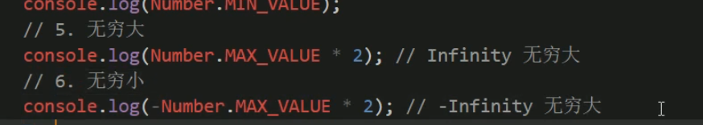
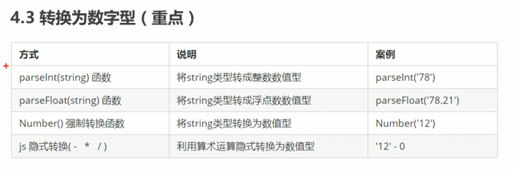
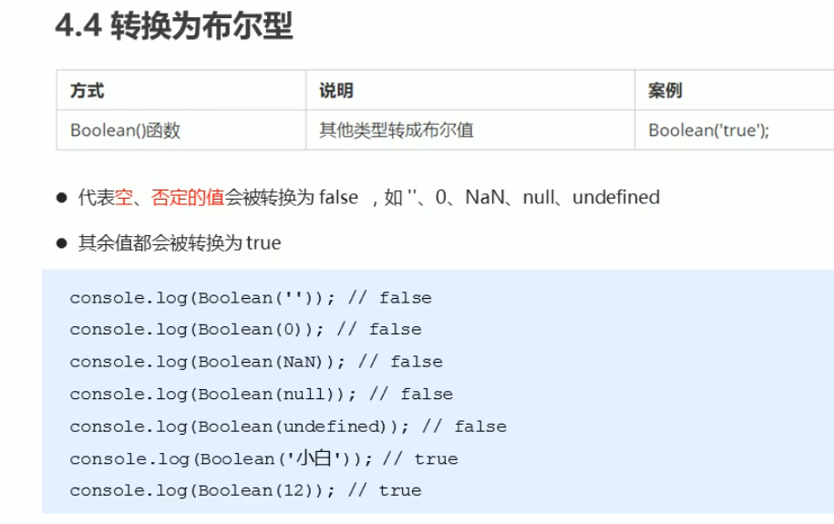
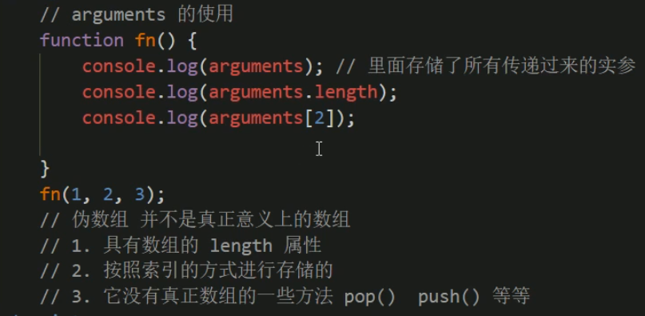
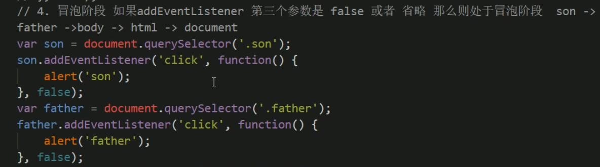
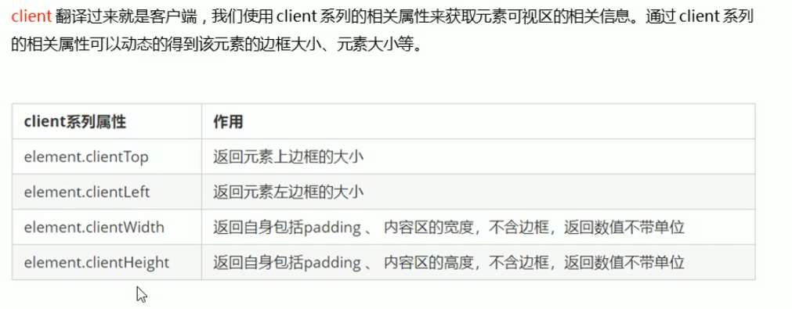
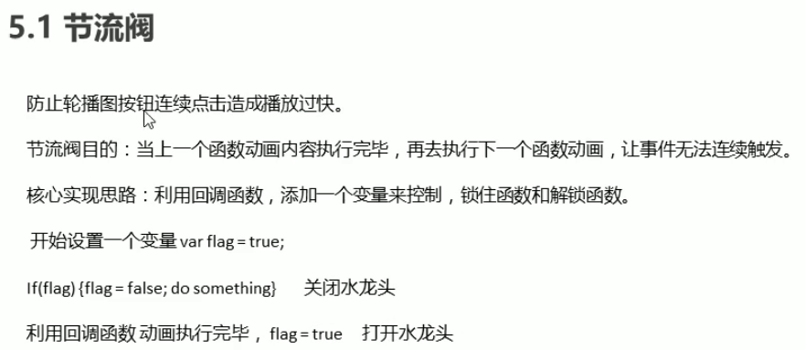

## 变量

驼峰命名

不以数字开头

区分大小写

不使用“关键字” ps：name也是关键字，尽量不使用

#### 数据类型

#### number

无穷大无穷小另外写法

isNaN()判断是否为非数字类型

#### String

#### Undefined和Null

#### typeof 检测数据类型

## 数据类型转换

#### 转字符串

#### 转换为数字类型

#### 转换为布尔类型

#### 解释型语言

#### 浮点数精度问题

#### 递增递减

++  --

++a 先自增再返回值，a++先返回原值再自加

#### **比较运算符== !=** 

#### 逻辑与 &&

短路运算

#### 赋值运算符

#### 运算符优先级

#### 三元表达式

#### switch case

表达式值和case值匹配时必须全等，即数据类型和内容一样

case不写break会继续执行下一个case(即使下一个case值和表达式值不符)，直到break

switch效率更高，不需要多次判断

#### 数组

追加

将旧数组某些符合条件的值存储到新数组 小技巧写法

newArr【newArr.length】完成新值添加和数组扩容

#### 形参实参匹配

#### arguments（不确定多少个参数传递）

#### 函数声明两种方式

用变量方式声明，函数为匿名函数，通过变量名调用，但变量名不是函数名

#### JavaScript预解析

将变量声明提升到顶部(变量的赋值不提升,在原位置)，然后再按顺序执行

#### 创建对象两种方式

二、var 对象={属性名:属性值}

#### 使用构造函数创建对象

**构造函数名首字母大写，不需要return就可以返回结果**

function 构造函数名(name){

//对象赋值用this

this.name=name

}

声明对象调用构造函数，加**new** ，var xx=new xxx()

#### for..in..循环，遍历数组或对象

#### MND文档查阅

 

#### Math

round()方法可以这样理解：

将括号内的数+0.5之后，向下取值，

比如：round(3.4)就是3.4+0.5=3.9，向下取值是3，所以round(3.4)=3; 

round(-10.5)就是-10.5+0.5=-10，向下取值就是-10，所以round(-10.5)=-10

#### Date

倒计时

####  创建数组两种方式

#### instanceof 判断是否为某个对象(例如判断数组)

#### 数组添加删除元素

返回的是数组长度

#### Array.sort() 坑

默认排序,按照字符串规则排序，如

要实现升序/降序排序写法

#### 数组转字符串

#### 数组连接，截取，删除部分

#### String  indexof

区别：
1、substring：两个参数会比较大小来判断哪一个是起始位参数哪一个是结束位置参数，通俗的讲就是小的一个数会作为起始 位置参数，大的一个数会作为结束位置参数；
slice：则不会有这样的规则，只遵循大于0，从前面计数，小于0，从后面计数的原则。
2、substring：除了两个参数会比较大小调换位置外，还满足小于0时按0处理的规则；
slice：则是根据大于0和小于0来判断计数的前后顺序

####  replace()替换 split()分割并返回数组

#### 简单数据类型，复杂数据类型

特殊点：赋值为**null时，用typeof返回的是object类型**

## Web API

#### DOM

根据id获取元素

HTML5新增根据classname获取元素

innerText innerHTML

#### 修改css样式

#### 获取自定义属性值

#### H5自定义属性

自定义属性以 data-  开头

#### H5新增的获取自定义属性的方法

建议还是使用getAttribute

### 节点操作

#### 父节点

element.**parentNode**

#### 子节点

**childNodes** 返回子节点集合 但是包括元素节点和文本节点，麻烦

**children**非标准，但只返回子元素节点，各个浏览器都支持

#### 第一个子元素和最后一个子元素

firstChild    lastChild 但是如果**有文本节点(例如换行空格，也会返回)** 不靠谱

fitstElementChild    lastElementChild   有兼容性问题 ie9以上才支持

实际写法

#### 兄弟节点

nextSibling  previousSibling 包含文本节点

nextElementSibling  

#### 创建&添加节点

创建节点

添加节点

#### 删除节点

####  复制节点

#### 三种动态创建元素方式区别

若innerHTML采用**多次**拼接字符串的操作效率会很低(String不可变,每次拼接时会开辟新的内存空间存储新的字符串变量)

#### 注册事件(绑定事件)两种方式

还有detachEvent()

#### 删除事件

#### DOM事件流

**事件冒泡 、事件捕获 二者区别**

父元素和子元素都有触发事件时，触发顺序不同，事件冒泡从下到上，事件捕获从上到下

注：假如**父元素绑定了点击事件，子元素没绑定，点击子元素也会触发执行父元素的点击事件**

#### 事件对象

#### 事件委托

#### 鼠标事件对象

#### 常用键盘事件

## BOM

#### window.onload 窗口加载事件

#### 调整窗口大小事件

 

#### 定时器setTimeout()

#### 清除定时器

#### 定时器setInterval()  重复调用

#### this指向问题

指向的是调用它的对象

全局作用域下，变量或函数实际都是全局对象window的属性,只是写的时候会省略window,所以指向window

在定时器里也是指向window，因为定时器是window的属性 window.setTimeout

方法调用中谁调用this指向谁

构造函数中this指向实例对象

#### 同步异步

定时任务或者click点击等回调函数，会先进入异步进程，当定时任务倒计时结束或触发回调函数时，任务才会进入任务队列(异步队列)，然后由主线程执行完主线程任务后查询异步队列的任务再执行

Js单线程：

在浏览器的一个页面中，该页面的的Js只有一个master主线程[Js脚本运行在上面]（注意：Js是单线程，**但浏览器内部并不是单线程**，I/O、定时器、事件监听等都是浏览器的其他线程完成的），所以叫单线程。

因为Js是单线程，所以程序的执行顺序都是从上到下依次进行的，同一时间内只能有一段代码被执行。

#### navigator对象

#### history对象

#### 元素偏移量offset

#### 元素client

边框指border ，和offsetWidth区别在包不包含边框

#### 立即执行函数

独立作用域，主要指函数名的声明(可以不给函数名也可以给)，不会影响到全局变量，不会被添加到全局变量里，所以用立即执行函数即使添加了函数名，在全局作用域也不能通过函数名再次调用方法(可用于初始化)

#### scroll属性

#### mouseenter 鼠标事件(移动到元素上时触发，mouseover)

mouseenter不会冒泡 只触发一次

## 动画

#### 节流阀(例如防止轮播图按钮连续点击播放过快)

#### 移动端触屏事件

#### 触摸事件对象(TouchEvent)

#### 用css的translateX代替动画函数

**transitionend**可用来监听过渡完成事件

#### classList 可以添加或切换类名(H5新增 相对classname可以追加类名不覆盖)

切换：有则删除，没有则添加

#### 移动端click延时解决方案

解决方案三：fastclick插件

#### swiper插件(移动端滑动效果插件)

## 本地存储

window.**sessionStorage**

**localStorage**

 

