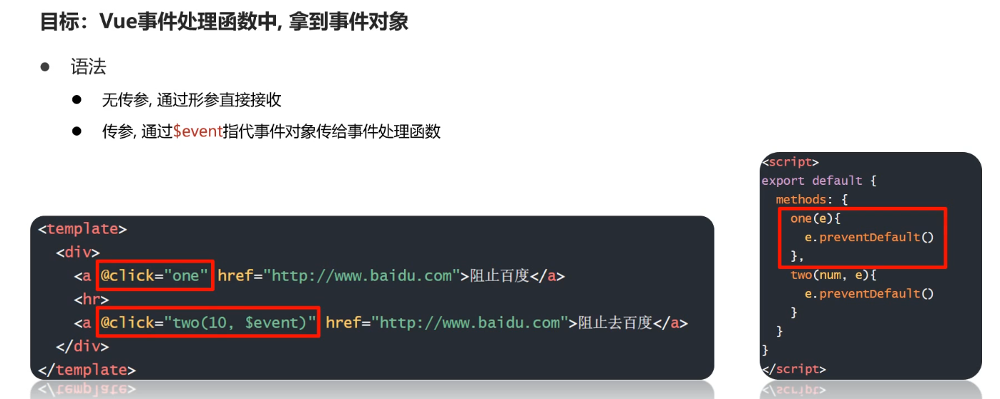
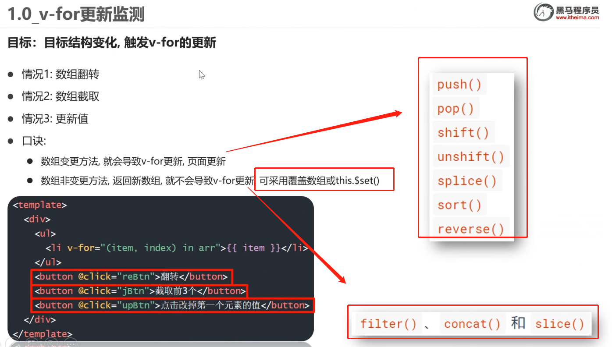
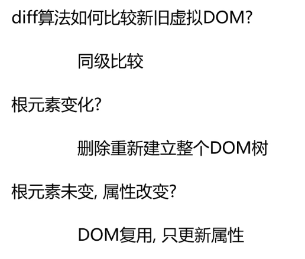
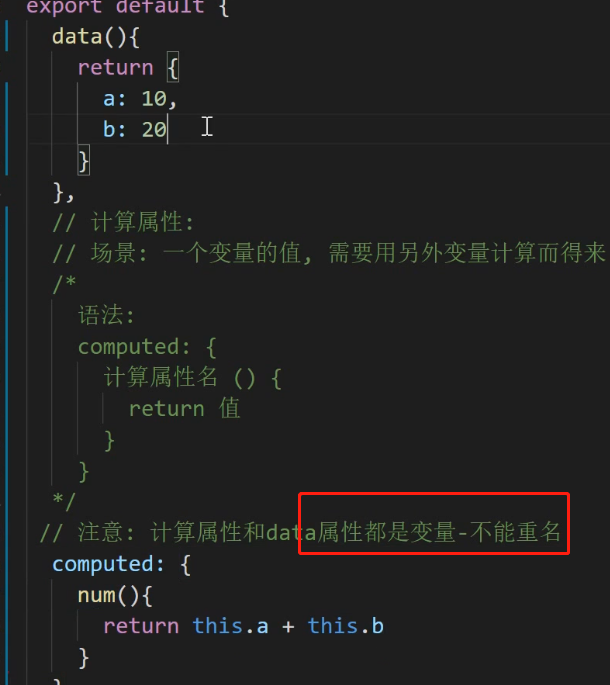
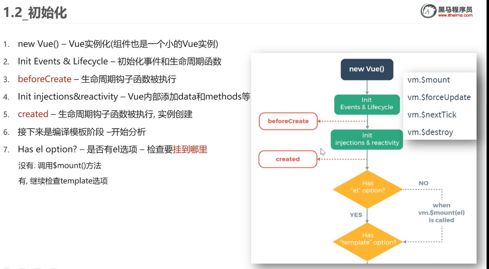
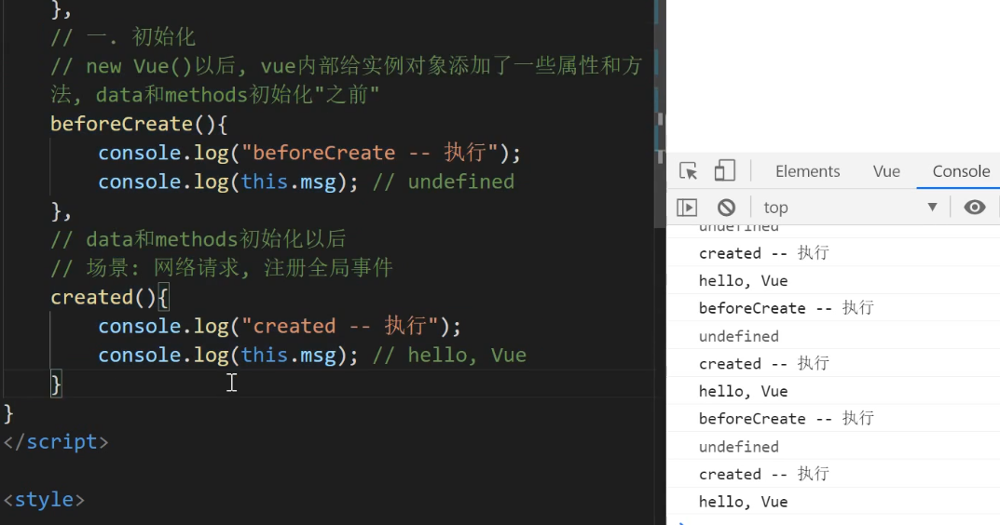
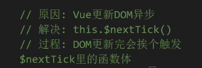
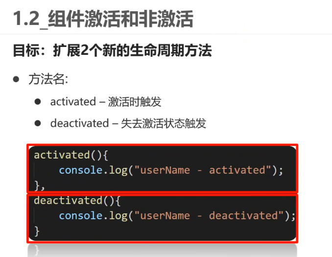
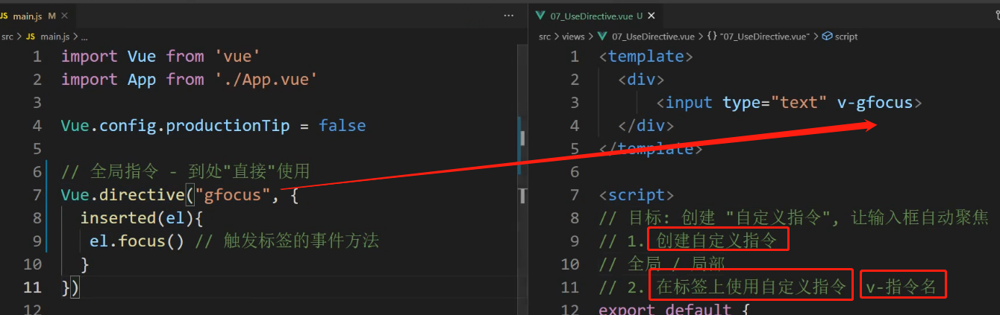
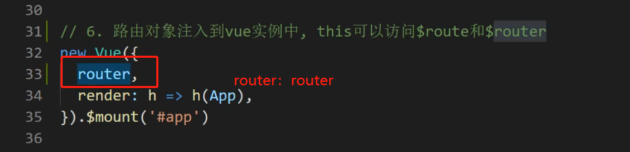

#### node.js 使用ES6模块化

npm  init -y 快速初始化创建package.json   添加 “type‘:"module"

#### 默认导出语法  export default(默认导出的成员)

 

#### 默认导入 import xx from xxxx

注：只能做一次默认导出  export default

导入时，变量名随意，合法即可

#### 按需导出/导入

#### 按需导入  使用{}，变量名必须和导出时一致，可使用as重命名

#### 直接导入并执行模块中的代码

## Promise

#### 回调地狱

#### promise解决fs.readFile()回调地狱

需要按顺序读取文件，readFile()是异步读取 直接多次调用无法保证读取顺序，需要嵌套在readFile（）方法的回调函数里，变成"回调地狱"(多个回调嵌套)

.catch捕捉错误

#### promise.all() 

#### Promise.race()

 

####  自己封装getFile()方法，通过Promise实现

### 下图是错误解释

上图是**错误**的，resolve和reject是promise类里自定义的变量(或者标记),

new Promise时，内部定义的方法就已经执行。正常操作是在定义内部需要执行的方法时根据执行成功或者失败，设置调用resolve()或reject()方法，**而resolve()和reject()方法是Promise对象自身封装的方法**，调用resolve()或reject()方法操作，是把执行成功or失败以及获取到的数据(调用resolve时作为形参传入)保存在Promise自身定义的变量里。

外部调用then方法时，就会**根据对象里保存的成功或失败结果**，执行用户给then方法传入的成功或失败回调函数

同时也将需要传递的数据传入回调方法中。

所以使用Promise时，需要在.Promise()后.then，.Promise().then()，在then里定义成功回调函数，才可以拿到结果值(赋值或者return)

因为then方法是Promise对象里的方法，写代码时不调用then或者不传递成功回调，就不会对之前resolve()方法保存在Promise对象里的结果数据做任何操作，也就无法拿到结果值。

需要在回调函数里设置return，也就是.then(成功function(){return 值}) 才能拿到返回的结果值。

所以在用Promise封装操作时，操作内容需要调用resolve()方法，并且外部调用then传入回调函数，才能拿到结果值。

如果是**await方式**，await可以直接提取内部执行resolve()方法时保存在Promise对象里的结果值，所以使用await就不需要使用then()

#### async/await  (ES8出现)

注意事项

#### EventLoop

#### 宏任务和微任务

注：new Promise(function(){}) 是同步任务，会立即执行function函数的内容

## Webpack

#### 初始化

#### 打包

#### 修改入口出口

#### HtmlWebpackPlugin 插件 自动生成入口html文件，并引入打包好的js文件

#### 打包css

css&style加载器

在打包入口的.js文件中import css

直接import的css文件无法识别 需要安装css loader style loader

#### less-loader

#### assert module资源模块  webpack5自带 打包静态资源文件

打包fonts文件

#### babel  babel-loader  (实现对js语法降级解决兼容问题)

webpack开发服务器

端口

## Vue

#### vue/cli 脚手架创建项目

npm install  @vue/cli -g  安装vue/cli

npm run serve开启热更新服务器

#### @vue/cli配置端口号

vue.config.js

#### eslint代码检查工具

#### 单Vue文件开发方式

#### Vue  插值表达式

MVVM设计模式

#### V-bind

#### v-on绑定事件

#### this指向当前export的对象

#### @事件名=“函数”

#### 接收事件对象(event)

####  v-on事件修饰符

#### 按键修饰符

#### v-model   双向绑定

#### v-model修饰符

v-text  v-html

#### v-show  v-if

#### V-for 

#### 补充：js里引入图片

#### v-for 更新检测

单纯改变数组中某个元素的值，不会触发更新，想要触发更新可采用this.$set()修改值

#### 虚拟dom

#### v-for  :key作用

值为索引时，li中的输入框还在原位置，没有跟随"老二，老三"，因为**diff算法**更新时尽量复用原标签，数组插入值，原索引对应的值发生了变化，更新时尽量复用原标签，所以只更新了对应的value，后面的输入框没有更新还在原位置

值为自定义id时，插入新数据，原数据对应的id不变，更新时尽量复用原标签，所以"老二，老三"对应的li标签不改变，直接插入新li，所以原值为“2，3”的输入框能够继续跟随"老二，老三"

#### 动态class

#### 动态style

 

#### 过滤器

#### 全局方式定义过滤器  Vue.filter

打包入口main.js中定义

#### 局部方式定义过滤器  filters{}

#### 过滤器传参 or 多过滤器

#### 计算属性 computed

#### 计算属性_缓存

计算属性的优势：有缓存，依赖项不变，从缓存中取值，减少运算

arry.reduce(),可用于计算累加累减

toFixed(n) 保留n位小数

#### 计算属性_完整写法

用**v-model双向绑定**给计算属性赋值或取值时，要用完整写法，给计算属性添加get set方法

补：arr.every（）遍历每个值，当有不符合条件的值时直接返回

#### 侦听器_watch

#### 深度侦听(侦听复杂数据类型 对象等)

#### 组件_基本使用

#### style 的scoped的原理

### 组件通信

#### 父组件 →子组件 传值

先在子组件props中定义接收的变量

#### 单向数据流 

#### 组件通信 子向父

**在父组件内，对引入的子组件绑定自定义事件和事件处理函数**

**在子组件内,用$emit() 触发调用父组件的自定义事件**

#### 跨组件传值  EventBus

在EventBus/ 中创建空白vue对象，两个组件共同引入该空白对象，

接收值的组件定义$on()监听事件

传值的组件调用$emit()触发事件

## 构子函数

#### 初始化

#### 挂载

#### 更新

#### 销毁

#### axios

#### 可以用扩展运算符...

#### 配置全局默认基地址

#### ref获取原生dom元素

#### 获取组件对象

#### vue更新DOM异步问题

#### 使用$nextTick解决dom异步更新问题

$nextTick

#### 组件里name属性作用

新知识点，对props接收的变量进行校验

#### 将axios挂载到全局vue

#### 动态组件

<component :is=""></component> 内置组件

变量名comName可以随意 属性值必须是想要展示的并且已注册的**组件名称**

#### 组件缓存

#### 组件激活和非激活(新生命周期方法)

#### 组件插槽

<slot></slot>

#### 一个组件多个slot

#### 作用域插槽

**上述"scope"可以随意命名，该变量名会自动绑定slot上所有属性和值**

#### 自定义指令

**全局**

**局部**

#### inserted指令所在标签被插入网页时执行，update指令对应数据或标签更新时执行

父传子，props接收值进行自定义校验 validator

## 路由

#### vue-router

基本使用

引入   路径@表示src的绝对地址

全局注册，设置规则

component里也可以写function

生成路由对象

路由对象注入vue实例

设置挂载点

hash值 指url上#后面内容

### 声明式导航

#### router-link (自动赋予被点击的active类名(可用来设置点击高亮))

#### 声明式导航-跳转传参

方式2：在路由规则上定义

#### 路由重定向

默认打开网页时，重定向到某个页面

添加匹配规则即可   redirect：

#### 路由404设置

#### 路由模式

#### 编程式导航

传参

方式2：添加name属性，用name属性进行跳转(需要修改路径时只需修改路由规则)

#### 编程式导航-跳转传参

使用path方式跳转，只能使用query方式传参

使用name方式跳转，则两者都可选

#### 路由嵌套

#### 声明式导航，active激活类名区别

精确匹配和模糊匹配

如：

#### 路由守卫(权限判断)

## vant组件库

引入所有

手动按需引入   引入组件 引入样式 手动注册

自动按需引入

babel-plugin-import

 

#### meta 元信息 保存路由对象额外信息

#### 二次封装axios和请求api(统一管理 避免请求散落在各个文件)

封装utils

封装每个页面对应的api请求

统一到index.js向外导出

Vant组件适配(px自动转成rem)

#### elementui  -select下拉框 v-model绑定获取选中的选项值

在select属性上加v-model绑定变量 可以获取下拉框的选中值

# Vue 中input或select绑定数字类型时的坑

要绑定数字类型，对应的value属性要加上v-bind, :value，不然还是字符类型

