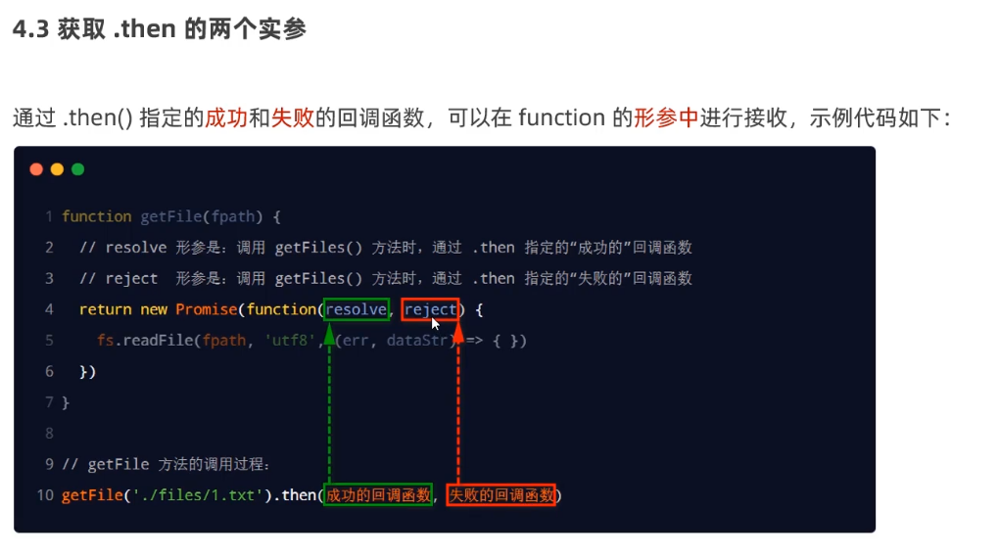
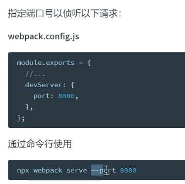
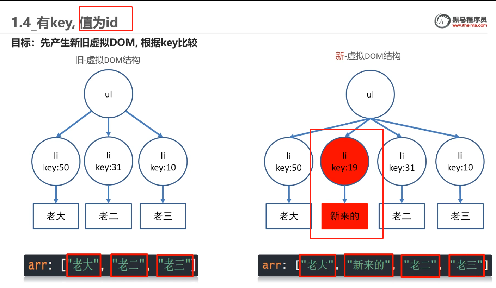
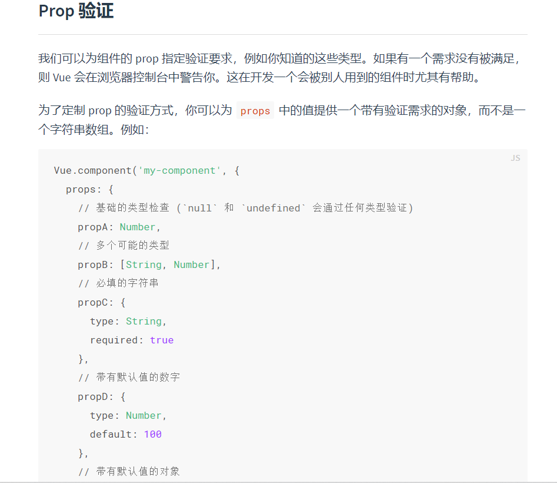
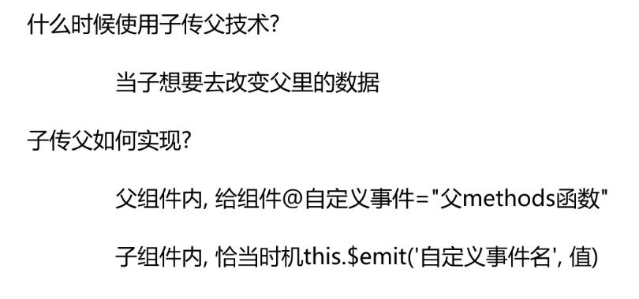
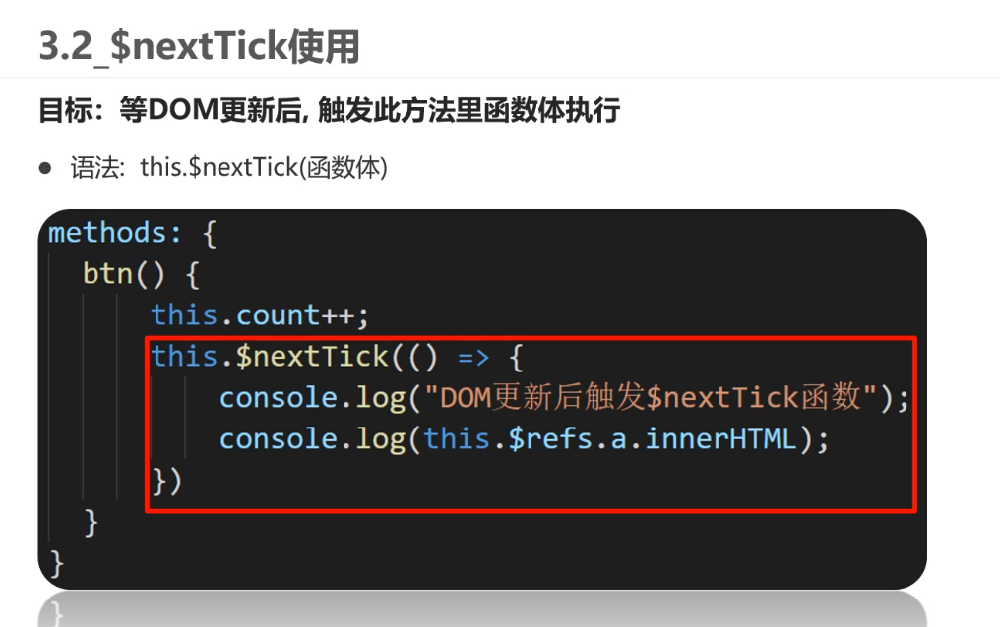
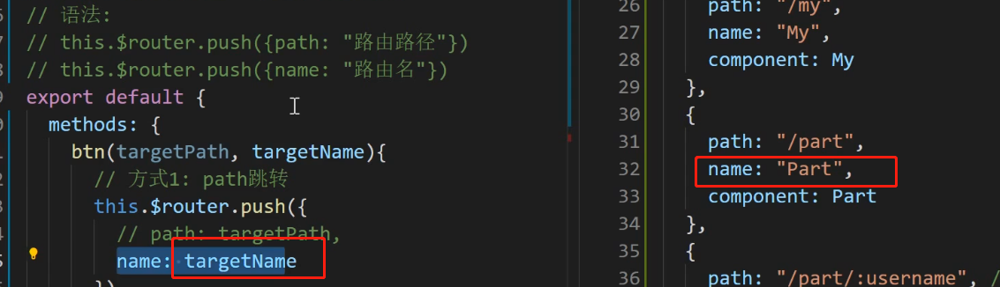

#### node.js 使用ES6模块化


npm  init -y 快速初始化创建package.json   添加 “type‘:"module"


#### 默认导出语法  export default(默认导出的成员)


 

#### 默认导入 import xx from xxxx


注：只能做一次默认导出  export default


导入时，变量名随意，合法即可


#### 按需导出/导入


#### 按需导入  使用{}，变量名必须和导出时一致，可使用as重命名


#### 直接导入并执行模块中的代码


## Promise

#### 回调地狱


#### promise解决fs.readFile()回调地狱

需要按顺序读取文件，readFile()是异步读取 直接多次调用无法保证读取顺序，需要嵌套在readFile（）方法的回调函数里，变成"回调地狱"(多个回调嵌套)


#### .catch(reject())捕捉错误

如果前面的then()，传递了错误回调的方法，就不会执行.catch()方法里的回调函数

前面then里没传，才会执行.catch里的错误回调

相关源码，其实.catch调用的还是then，传入回调函数

是否执行reject，then方法里做了相关的判断


#### promise.all() 


#### Promise.race()

 

####  自己封装getFile()方法，通过Promise实现


### 下图是错误解释



上图是**错误**的，resolve和reject是promise类里自定义的变量(或者标记),

new Promise时，内部定义的方法就已经执行。正常操作是在定义内部需要执行的方法时根据执行成功或者失败，设置调用resolve()或reject()方法，**而resolve()和reject()方法是Promise对象自身封装的方法**，调用resolve()或reject()方法操作，是把执行成功or失败以及获取到的数据(调用resolve时作为形参传入)保存在Promise自身定义的变量里。

外部调用then方法时，就会**根据对象里保存的成功或失败结果**，执行用户给then方法传入的成功或失败回调函数

同时也将需要传递的数据传入回调方法中。


所以使用Promise时，需要在.Promise()后.then，.Promise().then()，在then里定义成功回调函数，才可以拿到结果值(赋值或者return)

因为then方法是Promise对象里的方法，写代码时不调用then或者不传递成功回调，就不会对之前resolve()方法保存在Promise对象里的结果数据做任何操作，也就无法拿到结果值。


如果是**await方式**，await相当于then的语法糖，把await后的所有操作都包裹为成功回调resolve()，然后传递给then


#### async/await  (ES7出现)

#### 重：async/await相当于promise里then操作的语法糖

const result=await Promise(xxx) 

console.log(result)

**await相当于把await之后的操作包裹为一个成功回调resolve(val)，然后传入then方法里执行，**

即resolve(val){const result=val;console.log(result)}, Promise.then(resolve())

所以说await后的所有代码，相对于async外面的代码是异步的，因为await后的所有代码都是then的成功回调函数resolve()的内容

且，await Promise，该Promise如果执行失败，await后的所有代码也不会执行，因为await后的代码相当于成功回调方法里的内容


注意事项


#### EventLoop


#### 宏任务和微任务


注：new Promise(function(){}) 是同步任务，会立即执行function函数的内容


## Webpack

#### 初始化


#### 打包


#### 修改入口出口


#### HtmlWebpackPlugin 插件 自动生成入口html文件，并引入打包好的js文件


#### 打包css

css&style加载器

在打包入口的.js文件中import css


直接import的css文件无法识别 需要安装css loader style loader


#### less-loader


#### assert module资源模块  webpack5自带 打包静态资源文件


打包fonts文件


#### babel  babel-loader  (实现对js语法降级解决兼容问题)


webpack开发服务器


端口




## Vue

#### vue/cli 脚手架创建项目

npm install  @vue/cli -g  安装vue/cli


npm run serve开启热更新服务器


#### @vue/cli配置端口号

vue.config.js


#### eslint代码检查工具


#### 单Vue文件开发方式


#### Vue  插值表达式


MVVM设计模式


#### V-bind


#### v-on绑定事件


#### this指向当前export的对象


#### @事件名=“函数”


#### **native后缀(加在@事件名后面)**

**自定义组件**不加.native不会执行原生事件(如click等)

 我们可以称native为原型绑定。只有**使用vue组件时**我们会用到这个修饰符。当我们在组件上绑定监听时，我们绑定的是组件定义的监听。以element框架为例，<el-input>是element提供的组件。

在VUE中，**自定义组件上绑定的事件都是自定义事件(即使绑定@click也会被认为是自定义事件)**，无法直接绑定原生事件(如click)，调用自定义事件需要在组件内使用$emit()的方式

如果element没给el-input内部的原生input标签定义@click =$emit('click'),function)，那么我们这次绑定是无效的。


当我们加上native词缀，<el-input @click.native="">

加了native相当于**把自定义组件看成了html元素**可以**直接监听原生click事件(相当于给自定义组件的根元素添加了原生监听事件)**

(**部分组件不需要.native是因为组件已经替你封装好了方法(猜测是在子组件，原生标签上定义$emit('click')，则会调用外部使用组件时在组件上定义的@click事件))**

加了native相当于**把自定义组件看成了html元素**可以**直接监听原生click事件**,否则**自定义组件上绑定的事件默认是自定义事件**(自定义事件通过组件内部使用$emit进行调用)而你在自定义组件上没有定义这个事件,所以**不加native不会执行**


#### .self字段

阻止自己身上冒泡行为的触发

" .stop “和” .self “的区别：” .self “只会阻止自己身上冒泡行为的触发，并不会真正阻止 冒泡的行为。” .stop "会阻止所有的冒泡的行为。(.self修饰的元素的父元素仍会触发冒泡事件)


#### .prevent

阻止默认行为


#### 接收事件对象($event)


####  v-on事件修饰符


#### 按键修饰符


#### v-model   双向绑定


#### v-model修饰符


v-text  v-html


#### v-show  v-if


#### V-for 


#### 补充：js里引入图片


#### v-for 更新检测

**单纯改变数组中某个元素的值，不会触发更新，想要触发更新可采用this.$set()修改值**


#### 虚拟dom


#### v-for  :key作用


值为索引时，li中的输入框还在原位置，没有跟随"老二，老三"，因为**diff算法**更新时尽量复用原标签，数组插入值，原索引对应的值发生了变化，更新时尽量复用原标签，所以只更新了对应的value，后面的输入框没有更新还在原位置


值为自定义id时，插入新数据，原数据对应的id不变，更新时尽量复用原标签，所以"老二，老三"对应的li标签不改变，直接插入新li，所以原值为“2，3”的输入框能够继续跟随"老二，老三"





#### 动态class


#### 动态style


 

#### 过滤器


#### 全局方式定义过滤器  Vue.filter

打包入口main.js中定义


#### 局部方式定义过滤器  filters{}


#### 过滤器传参 or 多过滤器


#### 计算属性 computed


#### 计算属性_缓存

计算属性的优势：有缓存，依赖项不变，从缓存中取值，减少运算


arry.reduce(),可用于计算累加累减


toFixed(n) 保留n位小数


#### 计算属性_完整写法

用**v-model双向绑定**给计算属性赋值或取值时，要用完整写法，给计算属性添加get set方法


补：arr.every（）遍历每个值，当有不符合条件的值时直接返回


#### 侦听器_watch


#### 深度侦听(侦听复杂数据类型 对象等)


#### 组件_基本使用


组件命名和引用


#### style 的scoped的原理


### 组件通信

#### 父组件 →子组件 传值


**先在子组件props中定义接收的变量**





#### 单向数据流 


#### 组件通信 子向父




**在父组件内，对引入的子组件绑定自定义事件和事件处理函数**


**在子组件内,用$emit() 触发调用父组件的自定义事件**


##### 在用emit完成子向父组件传参，只有**单个参数时，在父组件可以用 $event指代子组件向父组件传递的那个参数(在自定义事件里，event代表传参)**

补：关于原生JavaScript传递event事件的内容，

1. 在最早的HTML事件处理程序中我们可以直接传入多个参数，并且可以不传入event直接传参，event可以调换前后顺序但必须是event关键字，不能是e ，如果是e就会报错：ReferenceError: e is not defined

2. 在"οnclick=function"以及addEventListener中不再看重event关键词，可以传任意标识，但只能传event(因为addEventListener三个参数，第一个事件名，第二个传递回调函数，第三个配置，无法直接传递其他参数)，默认只传入`event`参数，如果想传入其它参数，可以采用将方法进行封装来处理

  原文链接：https://blog.csdn.net/a1059526327/article/details/106392305/

**在例如上述，当传递给子组件的参数既要使用又要修改时，要先用props向子组件传递参数，然后在子组件里用$emit()调用事件修改数据，比较麻烦**，可以修改为v-model写法 如下：


v-model,相当于 :value="xxx"(向子组件传递了名为value的参数),且@input="xxx=$event"(声明了名为input的事件用来修改数据)，子组件需要在props声明value用于接收数据，修改数据则调用input事件

但value作为传递的参数名，语义不清晰，可以在**子组件**自定义v-model参数

prop定义子组件接收的参数名(自定义后就可以不用声明为value),还有上述的@input事件名，可以更改为自定义事件名


**.sync** 多个数据需要实现上述v-model的效果(一个组件里只能用一个v-model)，用.sync


.sync用法

// 子组件 update:固定写法 (update:props名称, 值)
this.$emit('update:showDialog', false) //触发事件
// 父组件 sync修饰符
<child  :showDialog.sync="showDialog" />

#### 跨组件传值  EventBus

在EventBus/ 中创建空白vue对象，两个组件共同引入该空白对象，

接收值的组件定义$on()监听事件

传值的组件调用$emit()触发事件


## 构子函数

 

#### 初始化


#### 挂载


#### 更新


#### 销毁


#### axios


#### 可以用扩展运算符...


#### 配置全局默认基地址


#### ref获取原生dom元素


#### ref作用在组件上时，可以获取组件对象实例(用实例可以调用组件方法)


#### vue更新DOM异步问题


#### 使用$nextTick解决dom异步更新问题





$nextTick


#### 组件里name属性作用


新知识点，对props接收的变量进行校验


#### 将axios挂载到全局vue


#### 动态组件

<component :is=""></component> 内置组件

变量名comName可以随意 属性值必须是想要展示的并且已注册的**组件名称**


#### 组件缓存


#### 组件激活和非激活(新生命周期方法)


#### 组件插槽

<slot></slot>


#### 一个组件多个slot


#### 作用域插槽


**上述"scope"可以随意命名，该变量名会自动绑定slot上所有属性和值**


#### 自定义指令


**全局**


**局部**


#### inserted指令所在标签被插入网页时执行，update指令对应数据或标签更新时执行


父传子，props接收值进行自定义校验 validator


## 路由

#### vue-router

基本使用

引入   路径@表示src的绝对地址


全局注册，设置规则


component里也可以写function


生成路由对象


路由对象注入vue实例


设置挂载点


hash值 指url上#后面内容


### 声明式导航

#### router-link (自动赋予被点击的active类名(可用来设置点击高亮))


#### 声明式导航-跳转传参


方式2：在路由规则上定义


参数后加?，代表参数非必传	

#### 路由重定向

默认打开网页时，重定向到某个页面

添加匹配规则即可   redirect：


#### 路由404设置


#### 路由模式


#### 编程式导航


传参


方式2：添加name属性，用name属性进行跳转(需要修改路径时只需修改路由规则)



#### 编程式导航-跳转传参

使用path方式跳转，只能使用query方式传参

使用name方式跳转，则两者都可选


#### 路由开启props传参

开启后可把路由参数映射到对应子组件props


#### 路由嵌套


#### 声明式导航，active激活类名区别

精确匹配和模糊匹配


如：


#### 路由守卫(权限判断)


#### 路由懒加载


通过函数返回的这种写法，在打包时，会把每个模块打包成单独的chunk包，引入时更有效

## vant组件库


引入所有


手动按需引入   引入组件 引入样式 手动注册


自动按需引入

babel-plugin-import


 

#### meta 元信息 保存路由对象额外信息


#### 二次封装axios和请求api(统一管理 避免请求散落在各个文件)


封装utils


封装每个页面对应的api请求


统一到index.js向外导出


Vant组件适配(px自动转成rem)


##### rootValue：设置根元素大小，一般设计为设计稿宽度的十分之一(375宽度设置37.5，750设置75)

项目中引用了amfe-flexible,动态地将1rem设置为屏幕宽度的10分之一(设置不同视窗下根节点的font-size)，而postcss则用来将px转化为rem数值(将代码里的px转为rem单位)，因为引用了amfe-flexible(十分之一)，所以postcss的rootValue设置为设计稿宽度的10分之一

vant按照37.5设计 (头条项目中按照750二倍图设计，因此除vant组件外，rootvalue为75)


{file} 解构赋值写法


#### elementui  -select下拉框 v-model绑定获取选中的选项值

在select属性上加v-model绑定变量 可以获取下拉框的选中值


# Vue 中input或select绑定数字类型时的坑

要绑定数字类型，对应的value属性要加上v-bind, :value，不然还是字符类型


flex-shrink:0 不参与flex布局宽度计算(某些情况下，对flex某个子元素单独设置宽度不起作用，宽度已被其余子元素分配完，可设置shrink：0让该子元素不参与flex的宽度计算)


#### $toast() 防止多次点击

 this.$toast.loading({

​        duration: 0, // 持续展示 toast

​        message: '操作中...',

​        forbidClick: true // 是否禁止背景点击

​      })

#### vant list组件几个属性含义


#### vant中List组件immediate-check


特殊情况，如使用了propub弹出层，弹出层里放置了list组件，若在lisi组件的created()中调用了加载数据的方法，在点击弹出弹出层时，由于判断了offset(其实还有隐形条件即loading为false)，组件自动加载了load方法，created里又调用了一次load方法，会调用两次

解决方法：immediate-check：false，关闭初始化时的滚动位置检查

另一种特殊情况：


#### Propub弹出层内容是懒渲染的

只有第一次弹出的时候会加载并渲染内容，弹出层关闭后内容还在，第二次点开不会重新加载

（比如里面用到了list组件，虽然传递过去的变量发生了改变，但list组件并不会自动重新加载数据，除非设置监听，在监听里进行修改，但比较麻烦，之间用v-if让整个组件在弹出层关闭时销毁，打开时重新加载）

若需要每次重新加载，将内容部分加上v-if(v-if为false会销毁内容，下一次为true重新加载)


#### 依赖注入 Provide(给所有后代组件传值)


#### 裁切工具库cropperjs


### Webpack proxy反向代理解决跨域问题

> 采用vue-cli的代理配置

vue-cli的配置文件即**`vue.config.js`**,这里有我们需要的 [代理选项](https://cli.vuejs.org/zh/config/#devserver-proxy)

```js
module.exports = {
  devServer: {
   // 代理配置
    proxy: {
        // 这里的api 表示如果我们的请求地址有/api的时候,就出触发代理机制
        // localhost:8888/api/abc  => 代理给另一个服务器
        // 本地的前端  =》 本地的后端  =》 代理我们向另一个服务器发请求 （行得通）
        // 本地的前端  =》 另外一个服务器发请求 （跨域 行不通）
        '/api': {
        target: 'www.baidu.com', // 我们要代理的地址
        changeOrigin: true, // 是否跨域 需要设置此值为true 才可以让本地服务代理我们发出请求
         // 路径重写
        pathRewrite: {
            // 重新路由  localhost:8888/api/login  => www.baidu.com/api/login
            '^/api': '' // 假设我们想把 localhost:8888/api/login 变成www.baidu.com/login 就需要这么做 
        }
      },
    }
  }
}
```

以上就是我们在vue-cli项目中配置的代理设置

**生产环境的跨域**

生产环境表示我们已经开发完成项目，将项目部署到了服务器上,这时已经没有了vue-cli脚手架的**`辅助`**了，我们只是把打包好的**`html+js+css`**交付运维人员，放到**`Nginx`**服务器而已,所以此时需要借助**`Nginx`**的反向代理来进行

```bash
server{
    # 监听9099端口
    listen 9099;
    # 本地的域名是localhost
    server_name localhost;
    #凡是localhost:9099/api这个样子的，都转发到真正的服务端地址http://baidu.com
    location ^~ /api {
        proxy_pass http://baidu.com;
    }    
}
```

**`注意`**:这里的操作一般由运维人员完成,需要前端进行操作,这里我们进行一下简单了解


#### 注册自定义指令

指令功能，给img标签绑定onerror函数(img标签加载地址错误时，会自动执行onerror函数，这里绑定onerror函数设定要执行的操作)，当图片加载失败时，使用默认图片


#### functional为true，表示该组件为一个函数式组件

函数式组件： 没有data状态，没有响应式数据，只会接收props属性， 没有this， 他就是一个函数


#### 利用sync修饰符关闭新增弹层

> vuejs为我们提供了**`sync修饰符`**，它提供了一种简写模式 也就是

```js
// 子组件 update:固定写法 (update:props名称, 值)
this.$emit('update:showDialog', false) //触发事件
// 父组件 sync修饰符
<child  :showDialog.sync="showDialog" />

```

只要用sync修饰，就可以省略父组件的监听和方法，直接将值赋值给showDialog


#### URl value字符串包含了=或&，需要进行转义

Url参数[字符串](https://so.csdn.net/so/search?q=%E5%AD%97%E7%AC%A6%E4%B8%B2&spm=1001.2101.3001.7020)中使用key=value键值对这样的形式来传参，键值对之间以&符号分隔，如/s?q=abc& ie=utf-8。如果你的**value字符串中包含了=或者&，那么势必会造成接收Url的服务器解析错误**，因此必须将引起歧义的&和= 符号进行转义，也就是对其进行编码。


#### :key 属性的另一个作用

:key值发生变化时，组件会重新渲染，某些情况下，由于组件没有重新渲染导致的bug，可以利用:key


#### // 开启域名/ip访问

​    config.devServer.disableHostCheck(true)


## 注意：用$emit修改父组件传过来的Props值，修改后在当前函数结束前不会立即生效，当前函数内拿到的Props值仍然是修改前的

若该函数内后续有需要用到修改后的值，则建议修改前创建一个中间变量newVal记录修改后的值

```js
Props:{
    checked  //传值为false
},
const changeChecked = () => {
      //创建中间变量newVal记录修改后的值
      const newVal = !checked.value
      emit('updateChecked', newVal) //newVal:true
      // 此时在当前函数结束前，checked值仍为原值 false,但父组件数据已完成修改
       console.log(checked.value) //false
       //若该函数内后续有需要用到修改后的值，则建议修改前创建一个中间变量newVal
      
    }
```