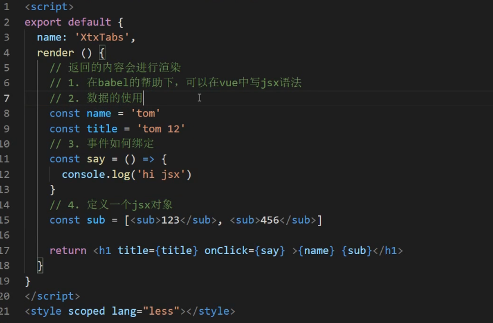

## 组合API-setup函数

- `setup` 是一个新的组件选项，作为组件中使用组合API的起点。

- 从组件生命周期来看，它的执行在组件实例创建之前`vue2.x的beforeCreate之前`执行。

- 这就意味着在**`setup`函数中 `this` 还不是组件实例**，`this` **此时是 `undefined`**

- 在模版中需要使用的数据和函数，需要**在 `setup` 返回(return)**。

  演示代码：

  ```
  <template>
    <div class="container">
      <h1 @click="say()">{{msg}}</h1>
    </div>
  </template>
  <script>
  export default {
    setup () {
      console.log('setup执行了')
      console.log(this)
      // 定义数据和函数
      const msg = 'hi vue3'
      const say = () => {
        console.log(msg)
      }

      return { msg , say}
    },
    beforeCreate() {
      console.log('beforeCreate执行了')
      console.log(this)
    }
  }
  </script>
  ```

**总结：** `setup` 组件初始化之前执行，它返回的数据和函数可在模版使用。

## 组合API-生命周期

> 目标：掌握使用组合API写法的生命周期钩子函数

回顾vue2.x生命周期钩子函数：

- beforeCreate
- created
- beforeMount
- mounted
- beforeUpdate
- updated
- beforeDestroy
- destroyed

认识vue3.0生命周期钩子函数

- `setup` 创建实例前
- `onBeforeMount` 挂载DOM前
- `onMounted` 挂载DOM后
- `onBeforeUpdate` 更新组件前
- `onUpdated` 更新组件后
- `onBeforeUnmount` 卸载销毁前
- `onUnmounted` 卸载销毁后

演示代码：


**总结：** 组合API的生命周期钩子有7个，可以多次使用同一个钩子，执行顺序和书写顺序相同。

## 组合API-reactive函数

定义响应式数据：

- reactive是一个函数，它可以定义一个复杂数据类型，成为响应式数据。

  

**总结：** 通常是用来定义响应式**对象数据**


## 组合API-toRef函数

定义响应式数据：

- toRef是函数，转换**响应式对象**中**某个**属性为单独响应式数据，并且**值是关联的**。

  

  使用场景：有一个响应式对象数据，但是模版中只需要使用其中一项数据

  ​

## 组合API-toRefs函数

定义响应式数据：

- toRefs是函数，转换**响应式对象**中所有属性为单独响应式数据，对象成为普通对象，并且**值是关联的**

  

  ​

使用场景：剥离响应式对象（解构|展开），想使用响应式对象中的多个或者所有属性做为响应式数据。


reactive函数，将一个对象包装为Proxy对象，对象的操作通过该Proxy对象完成。模板使用的响应式数据都为Proxy对象。不使用reative函数，直接return普通对象，对象内容发生改变，页面数据不会发生变化。

但将Proxy对象直接解构，返回的是普通类型数据，所以需要toRefs函数，会将Proxy对象全部属性再封装为一个新对象，key为正常属性名，存储的值为ObjectRefImpl对象(toRef则将Proxy对象其中一个属性封装为ObjectRefImpl对象)，该ObjectRefImpl对象的_object属性指向了原本的Proxy对象,value属性为存储值。于是可以将toRefs函数返回的再次封装过的对象直接进行解构return(解构出来为单个ObjectRefImpl对象)，并被模板页面引用，这样修改Proxy对象的值之后，页面引用的值也能跟着改变

#### 用toRef，toRefs函数封装后得到得ObjectRefImpl对象，对象的value属性存储值，所以修改值时要加上.value，

如图：第一个Proxy对象是reative用Proxy对象包装过的，需要在setup函数return的响应式对象

第二个对象是用toRefs函数再次封装过的，对应的name，age属性值指向ObjectRefImpl对象，ObjectRefImpl对象指向原本的第一个Proxy对象。该对象才能用于直接解构return{...obj2}


## 组合API-ref函数

定义响应式数据：

- ref函数，常用于简单数据类型定义为响应式数据(复杂数据类型也可以)
  - 再修改值，获取值的时候，需要.value
  - 在模板中使用ref申明的响应式数据，可以省略.value

演示代码：


**使用场景：**

- **当你明确知道需要的是一个响应式数据 对象 那么就使用 reactive 即可**

- **其他情况使用ref**

  ref()返回一个RefImpl对象

  

  ​

## 组合API-computed函数

> 目标：掌握使用computed函数定义计算属性

定义计算属性：

- computed函数，是用来定义计算属性的，计算属性不能修改。

基本使用：


高级用法：


目的：让计算属性支持双向数据绑定。

总结：计算属性两种用法

- 给computed传入函数，返回值就是计算属性的值
- 给computed传入对象，get获取计算属性的值，set监听计算属性改变


## 组合API-watch函数

定义计算属性：

- watch函数，是用来定义侦听器的

监听ref定义的响应式数据

监听多个响应式数据

监听reactive定义的响应式数据

监听reactive定义的响应式数据，某一个属性

深度监听

默认执行

```javascript
<template>
  <div class="container">
    <div>
      <p>count的值：{{count}}</p>
      <button @click="add">改数据</button>
    </div>
    <hr>
    <div>
      <p>{{obj.name}}</p>
      <p>{{obj.age}}</p>
      <p>{{obj.brand.name}}</p>
      <button @click="updateName">改名字</button>
      <button @click="updateBrandName">改品牌名字</button>
    </div>
  </div>
</template>
<script>
import { reactive, ref, watch } from 'vue'
export default {
  name: 'App',
  setup () {
    const count = ref(0)
    const add = () => {
      count.value++
    }
    // 当你需要监听数据的变化就可以使用watch
    // 1. 监听一个ref数据
    // 1.1 第一个参数  需要监听的目标
    // 1.2 第二个参数  改变后触发的函数
    // watch(count, (newVal,oldVal)=>{
    //   console.log(newVal,oldVal)
    // })
    const obj = reactive({
      name: 'ls',
      age: 10,
      brand: {
        id: 1,
        name: '宝马'
      }
    })
    const updateName = () => {
      obj.name = 'zs'
    }
    const updateBrandName = () => {
      obj.brand.name = '奔驰'
    }
    // 2. 监听一个reactive数据
    watch(obj, ()=>{
      console.log('数据改变了')
    })

    watch(()=>obj.brand, ()=>{
      console.log('brand数据改变了')
    },{
      // 5. 需要深度监听
      deep: true,
      // 6. 想默认触发
      immediate: true
    })
    // 3. 监听多个数据的变化
    // watch([count, obj], ()=>{
    //   console.log('监听多个数据改变了')
    // }) 
    // 4. 此时监听对象中某一个属性的变化 例如：obj.name 
    // 需要写成函数返回该属性的方式
    // watch(()=>obj.name,()=>{
    //   console.log('监听obj.name改变了')
    // })
    return {count, add, obj, updateName, updateBrandName}
  }}
</script>
```
监听对象中某一个属性的变化 例如：obj.name 需要写成函数返回该属性的方式()=>obj.name


实际上，如果监听的是最外层整个对象(上述代码的obj),内部所有属性值的改变，包括内部对象或多层嵌套对象值的改变时，都能触发方法。如果是监听,**对象里的某个值仍然为对象的属性**（{a：1，obj2：{xxx}}，监听obj2），则obj2里的属性值发生改变时不会触发，需要加深度监听deep


## 组合API-ref属性

获取DOM或者组件实例可以使用ref属性，写法和vue2.0需要区分开

获取单个DOM或者组件

```javascript
<template>
  <div class="container">
    <!-- vue2.0 获取单个元素 -->
    <!-- 1. 通过ref属性绑定该元素 -->
    <!-- 2. 通过this.$refs.box获取元素 -->
    <!-- <div ref="box">我是box</div> -->
    <!-- vue2.0 获取v-for遍历的多个元素 -->
    <!-- 1. 通过ref属性绑定被遍历元素 -->
    <!-- 2. 通过this.$refs.li 获取所有遍历元素  -->
    <!-- <ul>
      <li v-for="i in 4" :key="i" ref="li">{{i}}</li>
    </ul> -->
    <!-- 单个元素 -->
    <div ref="dom">我是box</div>
    <!-- 被遍历的元素 -->
    <ul>
      <li v-for="i in 4" :key="i" :ref="setDom">第{{i}}LI</li>
    </ul>
  </div>
</template>
<script>
import { onMounted, ref } from 'vue'
export default {
  name: 'App',
  setup () {
    // 1. 获取单个元素
    // 1.1 先定义一个空的响应式数据ref定义的
    // 1.2 setup中返回该数据，你想获取那个dom元素，在该元素上使用ref属性绑定该数据即可。
    const dom = ref(null)
    onMounted(()=>{
       console.log(dom.value)
    })
      return{dom}
  }
}
</script>
```

获取v-for遍历的DOM或者组件

```js
    // 2. 获取v-for遍历的元素
    // 2.1 定义一个空数组，接收所有的LI
    // 2.2 定义一个函数，往空数组push DOM
    const domList = [] 
    //setDom为组件上ref属性值
    const setDom = (el) => {
      domList.push(el)
    }
    onMounted(()=>{
      console.log(domList)
    })
    return {dom, setDom}
```

**总结：**

- 单个元素：先申明ref响应式数据，返回给模版使用，通过ref绑定数据

- 遍历的元素：先定义一个空数组，定一个函数获取元素，返回给模版使用，通过ref绑定这个函数

  - 有一个边界问题：组件更新的时候会重复的设置dom元素给数组：

  ```js
      // ref获取v-for遍历的DOM元素，需要在组件更新的时候重置接受dom元素的数组。
      onBeforeUpdate(()=>{
        list = []
      })
  ```


## 组合API-父子通讯

父传子：

```js
<template>
  <div class="container">
    <h1>父组件</h1>
    <p>{{money}}</p>
    <hr>
    <Son :money="money" />
  </div>
</template>
<script>
import { ref } from 'vue'
import Son from './Son.vue'
export default {
  name: 'App',
  components: {
    Son
  },
  // 父组件的数据传递给子组件
  setup () {
    const money = ref(100)
    return { money }
  }
}
</script>
```

```js
<template>
  <div class="container">
    <h1>子组件</h1>
    <p>{{money}}</p>
  </div>
</template>
<script>
import { onMounted } from 'vue'
export default {
  name: 'Son',
  // 子组件接收父组件数据使用props即可
  props: {
    money: {
      type: Number,
      default: 0
    }
  },
  setup (props) {
    // 获取父组件数据money
    console.log(props.money)
  }
}
</script>
```

子传父：

```js
<template>
  <div class="container">
    <h1>父组件</h1>
    <p>{{money}}</p>
    <hr>
+    <Son :money="money" @change-money="updateMoney" />
  </div>
</template>
<script>
import { ref } from 'vue'
import Son from './Son.vue'
export default {
  name: 'App',
  components: {
    Son
  },
  // 父组件的数据传递给子组件
  setup () {
    const money = ref(100)
+    const updateMoney = (newMoney) => {
+      money.value = newMoney
+    }
+    return { money , updateMoney}
  }
}
</script>
```

```js
<template>
  <div class="container">
    <h1>子组件</h1>
    <p>{{money}}</p>
+    <button @click="changeMoney">花50元</button>
  </div>
</template>
<script>
import { onMounted } from 'vue'
export default {
  name: 'Son',
  // 子组件接收父组件数据使用props即可
  props: {
    money: {
      type: Number,
      default: 0
    }
  },
  // props 父组件数据
  // emit 触发自定义事件的函数
+  setup (props, {emit}) { //第二个参数是context
    // 获取父组件数据money
    console.log(props.money)
    // 向父组件传值
+    const changeMoney = () => {
      // 消费50元
      // 通知父组件，money需要变成50
+      emit('change-money', 50)
+    }
+    return {changeMoney}
  }
}
</script>
```

扩展：

- 在vue2.x的时候 `.sync` 除去v-model实现双向数据绑定的另一种方式

```js
<Son :money.sync='money'  />  子组件里用emit（'update:money',50）
```

- 在vue3.0的时候，使用 `v-model:money="money"` 即可

```js
    <Son v-model:money="money" />
```

**总结：**

- 父传子：在setup种使用props数据 `setup(props){ // props就是父组件数据 }`
- 子传父：触发自定义事件的时候emit来自 `setup(props,{emit}){ // emit 就是触发事件函数 }`
- 在vue3.0中 `v-model` 和 `.sync` 已经合并成 `v-model` 指令


## 组合API-依赖注入（provide）

使用场景：有一个父组件，里头有子组件，有孙组件，有很多后代组件，共享父组件数据。

演示代码：

```js
<template>
  <div class="container">
    <h1>父组件 {{money}} <button @click="money=1000">发钱</button></h1>
    <hr>
    <Son />
  </div>
</template>
<script>
import { provide, ref } from 'vue'
import Son from './Son.vue'
export default {
  name: 'App',
  components: {
    Son
  },
  setup () {
    const money = ref(100)
    const changeMoney = (saleMoney) => {
      console.log('changeMoney',saleMoney)
      money.value = money.value - saleMoney
    }
    // 将数据提供给后代组件 provide
    provide('money', money)
    // 将函数提供给后代组件 provide
    provide('changeMoney', changeMoney)

    return { money }
  }
}
</script>
<style scoped lang="less"></style>
```

```js
<template>
  <div class="container">
    <h2>子组件 {{money}}</h2>
    <hr>
    <GrandSon />
  </div>
</template>
<script>
import { inject } from 'vue'
import GrandSon from './GrandSon.vue'
export default {
  name: 'Son',
  components: {
    GrandSon
  },
  setup () {
    // 接收祖先组件提供的数据
    const money = inject('money')
    return { money }
  }
}
</script>
<style scoped lang="less"></style>
```

```js
<template>
  <div class="container">
    <h3>孙组件 {{money}} <button @click="fn">消费20</button></h3>
  </div>
</template>
<script>
import { inject } from 'vue'
export default {
  name: 'GrandSon',
  setup () {
    const money = inject('money')
    // 孙组件，消费50，通知父组件App.vue组件，进行修改
    // 不能自己修改数据，遵循单选数据流原则，大白话：数据谁定义谁修改
    const changeMoney = inject('changeMoney')
    const fn = () => {
      changeMoney(20)
    }
    return {money, fn}
  }
}
</script>
<style scoped lang="less"></style>
```

**总结：**

- provide函数提供数据和函数给后代组件使用 (provide函数传给后代的变量值，在父组件不return也能在子组件接收到)

- inject函数给当前组件注入provide提供的数据和函数

  子孙组件想**修改数据**，同样也需要父组件用provide共享修改方法，子孙组件用inject获取方法


## 补充-v-model语法糖

在vue2.0中v-model语法糖简写的代码`<Son v-model="msg" />`相当于 `<Son :value="msg" @input="msg=$event" />`

在vue3.0中v-model语法糖有所调整：`<Son v-model="msg" />` 相当于`<Son :modelValue="msg" @update:modelValue="msg=$event" />`  在子组件直接用$emit(update:变量名,value) 修改值 相当于vue2的.sync 

演示代码：

```js
<template>
  <div class="container">
    <!-- 如果你想获取原生事件事件对象 -->
    <!-- 如果绑定事函数 fn fn(e){ // e 就是事件对象 } -->
    <!-- 如果绑定的是js表达式  此时提供一个默认的变量 $event -->
    <h1 @click="$event.target.style.color='red'">父组件 {{count}}</h1>
    <hr>
    <!-- 如果你想获取自定义事件  -->
    <!-- 如果绑定事函数 fn fn(data){ // data 触发自定义事件的传参 } -->
    <!-- 如果绑定的是js表达式  此时 $event代表触发自定义事件的传参 -->
    <!-- <Son :modelValue="count" @update:modelValue="count=$event" /> -->
    <Son v-model="count" />
  </div>
</template>
<script>
import { ref } from 'vue'
import Son from './Son.vue'
export default {
  name: 'App',
  components: {
    Son
  },
  setup () {
    const count = ref(10)
    return { count }
  }
}
</script>
```

```js
<template>
  <div class="container">
    <h2>子组件 {{modelValue}} <button @click="fn">改变数据</button></h2>
  </div>
</template>
<script>
export default {
  name: 'Son',
  props: {
    modelValue: {
      type: Number,
      default: 0
    }
  },
  setup (props, {emit}) {
    const fn = () => {
      // 改变数据
      emit('update:modelValue', 100)
    }
    return { fn }
  }
}
</script>
```

**总结：** vue3.0封装组件支持v-model的时候，父传子`:modelValue` 子传父 `@update:modelValue`

**补充：** vue2.0的 `xxx.sync` 语法糖解析 父传子 `:xxx` 子传父 `@update:xxx` 在vue3.0 使用 `v-model:xxx` 代替


## 补充-mixins语法

官方话术：

- 混入 (mixin) 提供了一种非常灵活的方式，来分发 Vue 组件中的可复用功能。一个混入对象可以包含任意组件选项。当组件使用混入对象时，所有混入对象的选项将被“混合”进入该组件本身的选项。

理解全局混入：所有组件混入了这些逻辑代码

```js
// 全局混入 全局mixin
// vue2.0 写法  Vue.mixin({})
app.mixin({
  methods: {
    say () {
      console.log(this.$el,'在mounted中调用say函数')
    }
  },
  mounted () {
    this.say()
  }
})
```

```js
<template>
  <div class="container1">
    <h1> 作者：周杰伦  <a href="javascript:;">关注</a> </h1>
    <hr>
    <Son />
  </div>
</template>
<script>
import Son from './Son.vue'
export default {
  name: 'App',
  components: {
    Son
  }
}
</script>
```

```js
<template>
  <div class="container2">
    <h2> 作者：周杰伦  <button>关注</button> </h2>
  </div>
</template>
<script>
export default {
  name: 'Son'
}
</script>
<style scoped lang="less"></style>
```

理解局部混入：通过mixins选项进行混入

```js
// 配置对象
export const followMixin =  {
  data () {
    return {
      loading: false
    }
  },
  methods: {
    followFn () {
      this.loading = true
      // 模拟请求
      setTimeout(()=>{
        // 省略请求代码
        this.loading = false
      },2000)
    }
  }
}
```

```js
<template>
  <div class="container1">
    <h1> 作者：周杰伦  <a href="javascript:;" @click="followFn">{{loading?'请求中...':'关注'}}</a> </h1>
    <hr>
    <Son />
  </div>
</template>
<script>
import Son from './Son.vue'
import {followMixin} from './mixins'
export default {
  name: 'App',
  components: {
    Son
  },
  mixins: [followMixin]
}
</script>
<template>
  <div class="container2">
    <h2> 作者：周杰伦  <button @click="followFn">{{loading?'loading...':'关注'}}</button> </h2>
  </div>
</template>
<script>
import {followMixin} from './mixins'
export default {
  name: 'Son',
  mixins: [followMixin]
}
</script>
<style scoped lang="less"></style>
```

**总结：** 在vue2.0中一些可复用的逻辑可以使用mixins来封装，当是需要考虑逻辑代码冲突问题。vue3.0的组合API很好的解决了这个问题，就不在推荐使用mixins了。


## vuex-基础

> 目的：知道每个配置作用，根模块vue3.0的用法，带命名空间模块再vue3.0的用法

1. 根模块的用法

定义

```js
vue2.0 创建仓库 new Vuex.Store({})
vue3.0 创建仓库 createStore({})
export default createStore({
  state: {
    username: 'zs'
  },
  getters: {
    newName (state) {
      return state.username + '!!!'
    }
  },
  mutations: {
    updateName (state) {
      state.username = 'ls'
    }
  },
  actions: {
    updateName (ctx) {
      // 发请求
      setTimeout(() => {
        ctx.commit('updateName')
      }, 1000)
    }
  },
  modules: {

  }
})
```

使用

```js
<template>
  <!-- vue2.0需要根元素，vue3.0可以是代码片段 Fragment -->
  <div>
    App
    <!-- 1. 使用根模块state的数据   -->
    <p>{{$store.state.username}}</p>
    <!-- 2. 使用根模块getters的数据   -->
    <p>{{$store.getters['newName']}}</p>
    <button @click="mutationsFn">mutationsFn</button>
  </div>
</template>
<script>
import { useStore } from 'vuex'
export default {
  name: 'App',
  setup () {
    // 使用vuex仓库
    const store = useStore()
    // 1. 使用根模块state的数据
    console.log(store.state.username)
    // 2. 使用根模块getters的数据
    console.log(store.getters.newName)
    const mutationsFn = () => {
      // 3. 提交根模块mutations函数
      // store.commit('updateName')
      // 4. 调用根模块actions函数
      store.dispatch('updateName')
    }
    return { mutationsFn }
  }
}
</script>
```

1. modules (分模块)

- 存在两种情况
  - 默认的模块，`state` 区分模块，其他 `getters` `mutations` `actions` 都在全局。
  - 带命名空间 `namespaced: true` 的模块，所有功能区分模块，更高封装度和复用。

```js
import { createStore } from 'vuex'

const moduleA = {
  // 子模块state建议写成函数
  state: () => {
    return {
      username: '模块A'
    }
  },
  getters: {
    changeName (state) {
      return state.username + 'AAAAAA'
    }
  }
}

const moduleB = {
  // 带命名空间的模块
  namespaced: true,
  // 子模块state建议写成函数
  state: () => {
    return {
      username: '模块B'
    }
  },
  getters: {
    changeName (state) {
      return state.username + 'BBBBBB'
    }
  },
  mutations: {
    // 修改名字的mutation
    update (state) {
      state.username = 'BBBB' + state.username
    }
  },
  actions: {
    update ({ commit }) {
      // 假设请求
      setTimeout(() => {
        commit('update')
      }, 2000)
    }
  }
}

// 创建vuex仓库并导出
export default createStore({
  state: {
    // 数据
    person: [
      { id: 1, name: 'tom', gender: '男' },
      { id: 2, name: 'lucy', gender: '女' },
      { id: 3, name: 'jack', gender: '男' }
    ]
  },
  mutations: {
    // 改数据函数
  },
  actions: {
    // 请求数据函数
  },
  modules: {
    // 分模块
    a: moduleA,
    b: moduleB
  },
  getters: {
    // vuex的计算属性
    boys: (state) => {
      return state.person.filter(p => p.gender === '男')
    }
  }
})
```

使用：

```js
<template>
 <div>APP组件</div>
 <ul>
   <li v-for="item in $store.getters.boys" :key="item.id">{{item.name}}</li>
 </ul>
 <!-- 使用模块A的username -->
 <p>A的username --- {{$store.state.a.username}}</p>
 <p>A的changeName --- {{$store.getters.changeName}}</p>
 <hr>
 <p>B的username --- {{$store.state.b.username}}</p>
 <p>B的changeName --- {{$store.getters['b/changeName']}}</p>
 <button @click="$store.commit('b/update')">修改username</button>
 <button @click="$store.dispatch('b/update')">异步修改username</button>
</template>
```
## 补充-vue动画

> **目标：** 知道vue中如何使用动画，知道Transition组件使用。

当vue中，显示隐藏，创建移除，一个元素或者一个组件的时候，可以通过transition实现动画。


如果元素或组件离开，完成一个淡出效果：

```js
<transition name="fade">
  <p v-if="show">100</p>
</transition>
```

```js
.fade-leave {
    opacity: 1
}
.fade-leave-active {
    transition: all 1s;
}
.fade-leave-to {
    opcaity: 0
}
```

- 进入（显示，创建）
  - v-enter 进入前 （vue3.0 v-enter-from）
  - v-enter-active 进入中
  - v-enter-to 进入后
- 离开（隐藏，移除）
  - v-leave 进入前 （vue3.0 v-leave-from）
  - v-leave-active 进入中
  - v-leave-to 进入后

多个transition使用不同动画，可以添加nam属性，name属性的值替换v即可。

**<transition></transition>里有注释可能会影响**


## vueuse/core 懒加载`useIntersectionObserver` 

```js
// stop 是停止观察是否进入或移出可视区域的行为    
const { stop } = useIntersectionObserver(
  // target 是观察的目标dom容器，必须是dom容器，而且是vue3.0方式绑定的dom对象
  target,
  // isIntersecting 是否进入可视区域，true是进入 false是移出
  // observerElement 被观察的dom
  ([{ isIntersecting }], observerElement) => {
    // 在此处可根据isIntersecting来判断，然后做业务
  },
)
```

## vueuse/core的懒加载方法基于Web Api IntersectionObserver

介绍一个webAPI：[IntersectionObserver(opens new window)](https://developer.mozilla.org/en-US/docs/Web/API/IntersectionObserver/IntersectionObserver)

```js
// 创建观察对象实例
const observer = new IntersectionObserver(callback(entries,observer),[ options])
// callback 被观察dom进入可视区离开可视区都会触发
// - 两个回调参数 entries , observer
// - entries 被观察的元素信息对象的数组 [{元素信息},{}]，信息中isIntersecting判断进入或离开
// - observer 就是观察实例
// options 配置参数
// - 三个配置属性 root rootMargin threshold
// - root 基于的滚动容器，默认是document
// - rootMargin 容器有没有外边距
// - threshold 交叉的比例

// 实例提供两个方法
// observe(dom) 观察哪个dom
// unobserve(dom) 停止观察那个dom
```

基于vue3.0和IntersectionObserver封装图片懒加载指令


```js
export default {
  install (app) 
    {    defineDirective(app)
  }
}
import defaultImg from '@/assets/images/200.png'
// 指令
const defineDirective = (app) => {
  // 图片懒加载指令
  app.directive('lazyload', {
      //2.0监听元素创建方法用inserted 3.0用mounted
    mounted (el, binding) {
      const observer = new IntersectionObserver(([{ isIntersecting }],observer) => {
        if (isIntersecting) {
            //关闭第二次反复监听
          observer.unobserve(el)
          el.onerror = () => {
              el.src = defaultImg
          }  
          el.src = binding.value
        }
      }, {
        threshold: 0.01
      })
      observer.observe(el)
    }
  })
}
```

使用指令：

```js
               
```
## render函数拼接创建组件内容

[createElement (opens new window)](https://cn.vuejs.org/v2/guide/render-function.html#createElement-%E5%8F%82%E6%95%B0)[render (opens new window)](https://cn.vuejs.org/v2/api/#render)`render选项与h函数`

- 指定组件显示的内容：

  ```
  new Vue({选项})
  ```

  - el 选项，通过一个选择器找到容器，容器内容就是组件内容
  - template 选项，`<div>组件内容</div>` 作为组件内容
  - render选项，它是一个函数，函数回默认传人createElement的函数（h），这个函数用来创建结构，render函数返回渲染为组件内容。它的优先级更高。

```js
在2.0main.js中
//import App from './App.vue'
//new Vue({
//    render:h=>h(App)
//}).mount('#app')
// h() =====>  createElement()
// h(App) =====>  根据APP组件创建html结构
// render的返回值就是html结构，渲染到#app容器
// h() 函数参数，1.节点名称  2. 属性|数据 是对象  3. 子节点
```

综上，可以通过render方式定义组件内容(当直接写模板不够灵活的时候)，通过h()创建节点

`xtx-bread.vue`

```js
<script>
import { h } from 'vue'
export default {
  name: 'XtxBread',
  render () {
    // 用法
    // 1. template 标签去除，单文件组件
    // 2. 返回值就是组件内容
    // 3. vue2.0 的h函数传参进来的，vue3.0 的h函数导入进来
    // 4. h 第一个参数 标签名字  第二个参数 标签属性对象  第三个参数 子节点
    // 需求
    // 1. 创建xtx-bread父容器
    // 2. 获取默认插槽内容
    // 3. 去除xtx-bread-item组件的i标签，因该由render函数来组织
    // 4. 遍历插槽中的item，得到一个动态创建的节点，最后一个item不加i标签
    // 5. 把动态创建的节点渲染再xtx-bread标签中
    const items = this.$slots.default()
    const dymanicItems = []
    items.forEach((item, i) => {
      dymanicItems.push(item)
      if (i < (items.length - 1)) {
        dymanicItems.push(h('i', { class: 'iconfont icon-angle-right' }))
      }
    })
    return h('div', { class: 'xtx-bread' }, dymanicItems)
  }
}
</script>
```

- 使用代码

```js
      <!-- 面包屑 -->
      <XtxBread>
        <XtxBreadItem to="/">首页</XtxBreadItem>
        <XtxBreadItem to="/category/1005000">电器</XtxBreadItem>
        <XtxBreadItem >空调</XtxBreadItem>
      </XtxBread>
```
### emits

Vue官方建议我们在组件中所有的emit事件都能在组件的`emits`选项中声明

emits参数有俩种形式对象和数组，对象里面可以配置带校验emit事件，为null的时候代表不校验，校验的时候，会把emit事件的参数传到校验函数的参数里面

当校验函数不通过的时候，控制台会输出一个警告，但是emit事件会继续执行


#### mockjs


#### 路由active属性激活

```
router-link-active  模糊匹配   当你的路由路径包含 router-link组件的to属性值，当前组件会加上它
router-link-exact-active  精准匹配 当你的路由路径完全和你的router-link组件的to属性值一致，当前组件会加上它
```

可以设置激活时使用其他类名 如active

<RouterLink exact-active-class="active" to=''>

也可以在创建路由实例时传入参数进行配置 具体参考文档

注意：vue3.0 router-link-active 在某些情况下加不上，路由路径需要有路由嵌套关系。

- 例如：`/member` `/member/other` 但是不是嵌套路由，不会加上这个类 router-link-active

  改写为嵌套写法，而且可以直接设置用h()挂载RouterView组件(不然需要在对应的vue文件手动添加routerview)


jsx语法

 https://cn.vuejs.org/v2/guide/render-function.html

省去手动createElement 挂载dom节点的麻烦


