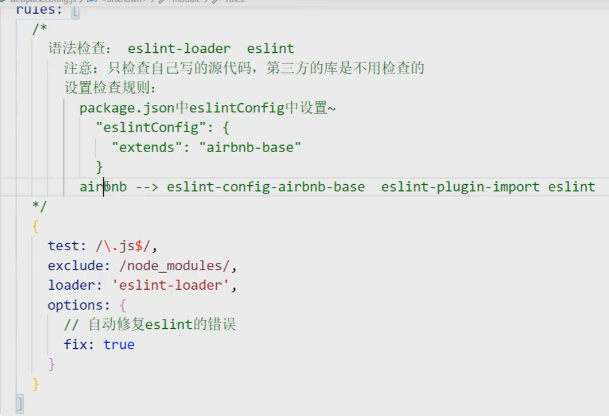
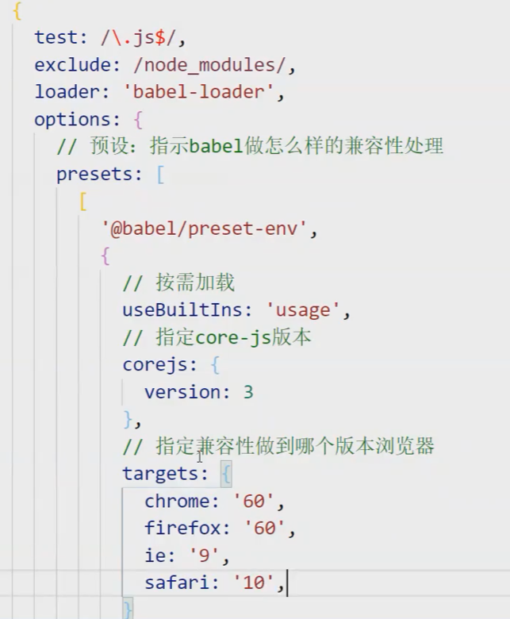

## 基础配置

use里添加的loader，从后往前执行

要使用多个loader，用use:[],只需一个loader，直接loader:xxx

## 常用配置项

entry 入口(单入口多入口，可通过object方式多入口)

output 输出 内有 filename  path

module:{rules:[]} loader 配置  

​        内部 test  匹配文件类型

​                  use 使用的loader 有多个用数组形式

​       		   exclude 忽略哪些(目录)

​		   include 只检查哪些(目录)

plugin

devServer webpack服务器

## 常见loader或plugin

#### css-loader 读取css

#### Styel-loader 创建style标签，将样式放入

#### less-loader  读取less

#### url-loader  打包jpg png gif等图片资源(也会把html里引入的路径自动更换为打包后的路径)

#### file-loader 打包除了js，css,less,html图片之外的其他静态资源文件

#### MiniCssExtractPlugin.loader 将js文件里的css单独提取为.css文件

#### postcss-loader 可以做css的兼容性处理

#### eslint-loader   eslint语法检查

#### fix:true 自动修复错误

#### babel-loader  js兼容性处理  

1、基本的兼容处理 如let const 2、复杂的，比如promise，则需要使用corejs库

#### HtmlWebpackPlugin  指定某个html为模板，作为打包文件的html入口

#### OptimizeCssAssetsWebpackPlugin  压缩css

#### cleanwebPackPlugin 打包自动删除上次打包文件

## webpack性能优化

#### tree shaking  

去除无用代码(比如引用了但没使用)  开启production环境就自动会有

#### 多进程打包 thread-loader

#### HMR功能 热更新打包

#### oneOf  oneOf内的loader只会匹配一个

有些文件会重复多次被相同loader处理，

比如处理less文件，需要less-loader，css-loader和style-loader，而css文件里同样需要css-loader和style-loader

先处理完的less文件变成css文件后又重复进行了一次loader加载

#### babel缓存 

第二次打包构建速度更快

cacheDirectory：true

由于缓存，可能会出现修改了样式但没生效(读取的旧缓存)的问题

解决：打包出口文件名加上contenthash

#### splitChunks代码分包

方式一：添加多入口 每个入口单独打包为一个chunk

方式二：添加配置splitchunks，会将引用的node_modules(第三方库)中的代码单独打包为一个chunk

#### externals，忽略某个库的打包

有些库，可以使用cdn引入，用externals，在打包时忽略

#### 懒加载预加载

改变原本文件头import xx from ‘xx’的写法

## bundle和chunk

1、对于一份同逻辑的代码，当我们手写下一个一个的文件，它们无论是 ESM 还是 commonJS 或是 AMD，他们都是 module ；

2、当我们写的 module 源文件传到 webpack 进行打包时(根据module:rules里的配置，使用对应的loader)，webpack 会根据文件引用关系生成 chunk 文件，比如有引用关系的几个module模块会生成一个chunk。

通过配置，也可以让一些被多个模块都引用的公共模块抽离出来单独打包为一个chunk，减少其他chunk模块的大小

3、webpack 处理好 chunk 文件后，最后会输出 bundle 文件，这个 bundle 文件包含了经过加载和编译的最终源文件，所以它可以直接在浏览器中运行。一个bundle可能有多个chunk

## 为什么需要webpack打包？

效率，按照传统方式分割多个文件夹和文件，浏览器加载资源时要发送多个http请求。通过打包把部分资源文件合并为一个包

其次，webpack在打包过程中可以对代码进行一些处理，比如css js的兼容性处理，还能够压缩代码空格减小文件大小

使用vue等框架开发(或者ts)，也需要通过webpack处理为浏览器可识别的文件

## Webpack构建流程

1. 以entry为入口，找到依赖的module
2. 每找到一个module，就会根据配置的loader去找对应的转换规则(包括less解析 eslint校验 代码压缩等)
3. 对module进行转换后，再解析出当前module依赖的module
4. 通过模块间的依赖关系，将不同的模块打包为一个chunk，通常是把有依赖关系的几个模块打包为一个chunk
5. 最后Webpack会把所有Chunk转换成文件输出到文件系统，并生成最终的bundle