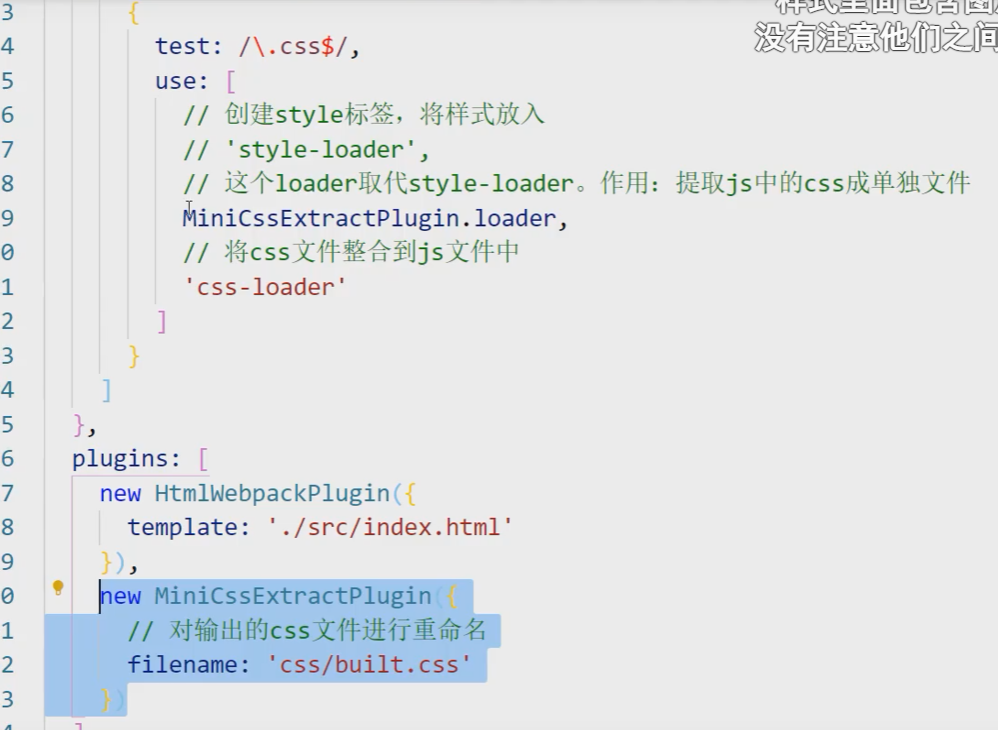
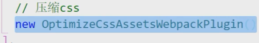

## 基础配置

use里添加的loader，从后往前执行

要使用多个loader，用use:[],只需一个loader，直接loader:xxx

## 常用配置项

entry 入口(单入口多入口，可通过object方式多入口)

output 输出 内有 filename  path

module:{rules:[]} loader 配置  

​        内部 test  匹配文件类型

​                  use 使用的loader 有多个用数组形式

​       		   exclude 忽略哪些(目录)

​		   include 只检查哪些(目录)

plugin

devServer webpack服务器

## 常见loader或plugin

#### css-loader 读取css

#### Styel-loader 创建style标签，将样式放入

#### less-loader  读取less

#### HtmlWebpackPlugin  指定某个html为模板，作为打包文件的html入口

#### url-loader  打包jpg png gif等图片资源(也会把html里引入的路径自动更换为打包后的路径)

#### file-loader 打包除了js，css,less,html图片之外的其他静态资源文件

#### MiniCssExtractPlugin.loader 将js文件里的css单独提取为.css文件

#### postcss-loader 可以做css的兼容性处理

#### OptimizeCssAssetsWebpackPlugin  压缩css

#### eslint-loader   eslint语法检查

#### fix:true 自动修复错误

#### babel-loader  js兼容性处理  

1、基本的兼容处理 如let const 2、复杂的，比如promise，则需要使用corejs库

## webpack性能优化

#### tree shaking  

去除无用代码(比如引用了但没使用)  开启production环境就自动会有

#### 多进程打包 thread-loader

#### HMR功能 热更新打包

#### oneOf  oneOf内的loader只会匹配一个

有些文件会重复多次被相同loader处理，

比如处理less文件，需要less-loader，css-loader和style-loader，而css文件里同样需要css-loader和style-loader

先处理完的less文件变成css文件后又重复进行了一次loader加载

#### babel缓存 

第二次打包构建速度更快

cacheDirectory：true

由于缓存，可能会出现修改了样式但没生效(读取的旧缓存)的问题

解决：打包出口文件名加上contenthash

#### splitChunks代码分包

方式一：添加多入口 每个入口单独打包为一个chunk

方式二：添加配置splitchunks，会将引用的node_modules(第三方库)中的代码单独打包为一个chunk

#### externals，忽略某个库的打包

有些库，可以使用cdn引入，用externals，在打包时忽略

#### 懒加载预加载

改变原本文件头import xx from ‘xx’的写法

