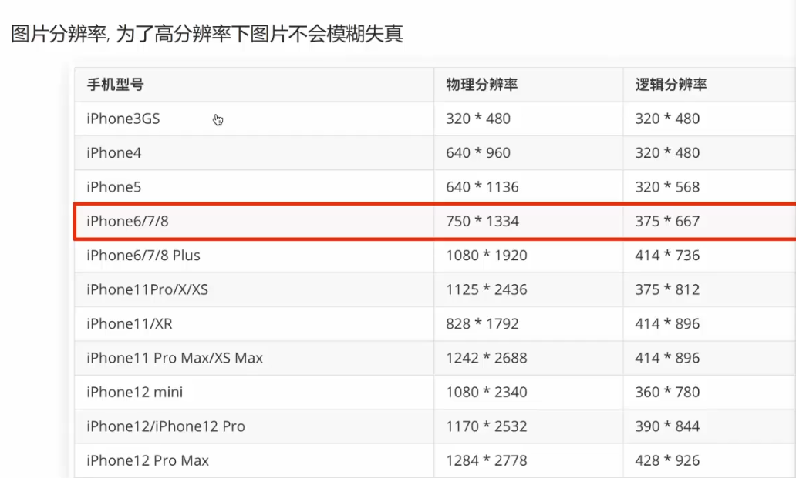
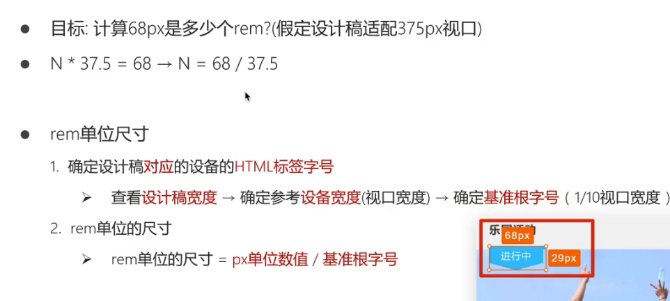
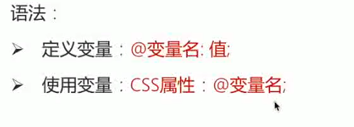

默认存在


#### 二倍图

750像素图



物理分辨率高，逻辑分辨率低时，表现出来的视觉效果就是图片被放大(参考windows系统,分辨率设置,屏幕为1920，系统设置的逻辑分辨率越低时图标越大,越模糊。)

图中iphone6/7/8的物理/逻辑像素比为2:1，即50x50的图片,在手机中会被放大为两倍即100x100,为了让图片不模糊,所以使用二倍图(一倍为375px,二倍为750px)


## Flex布局


默认主轴在水平方向，弹性盒子延主轴方向排列


#### 主轴对**齐**方式(盒子的排列方式)

**justify-content**


center：    

around:

between:


evenly:

## 侧轴对齐方式(排列方式)

align-items


stretch为默认属性，子盒子不设置高度，默认拉伸占满父元素高度

子盒子不设置宽度，宽度为内容宽度。

子盒子单独设置了align-self，没有设置高度，则高度为内容的高度


## 伸缩比


## Flex-修改主轴方向

flex-direction

设置为column 则一行一个


## 弹性盒子换行

flex-wrap：wrap；


#### 调整行对齐方式


flex小技巧，文字溢出显示省略号


width设置盒子宽度，或直接设置为0，设置为0需要配合flex:1

设置flex:1，因为是弹性盒子(宽度会自动加大)，white-space:nowrap不换行，盒子会被撑大,overflow:hidden不起作用,所以设置width:0

#### **white-space属性**

white-space 属性设置处理元素内的空白，所谓空白有哪些？

**Space(空格)、Enter(回车)、Tab(制表符)**

我们熟知的是：

1. 在开发中，无论我们敲多少空格和回车，显示在页面上的都会合并成一个。
2. 我们的文字在超过一行的情况下，就会**自动换行**。


pre:原样输出指文本多少个空格页面就显示多少空格，有回车就换行，没有回车，超过时不换行

想要文字溢出的部分自动用省略号表示，那么离不开三个属性:

```
white-space: nowrap; /*强制内容在一行显示*/
overflow: hidden;/*超出部分溢出*/
text-overflow: ellipsis;/*溢出的部分使用省略号*/
```


## 移动适配

rem:单位


计算rem



#### 使用flexible.js代替手动写媒体查询


个人理解：

首先要拿到设计稿本身是相对哪个屏幕宽度设计的，假设以375宽度设计,font-size设计为对应的屏幕宽度除以10，本质上是把手机屏幕分为10份，以设计稿所量尺寸除以÷font-size(当前屏幕宽度的1/10),得到的rem值本质上可以理解为该尺寸占10等份中1份的比例。换设备后,屏幕宽度不同,但是font-size是由新的屏幕宽度决定的(屏幕宽度的十分之1)，由rem值(其实相当于百分比占比)乘以新的font-size，得到的该设计图在另一屏幕对应的具体尺寸，因为是按相同的屏幕占比计算得到，所以该部分的内容在不同的屏幕设备上会有自适应的效果。

为什么不直接写百分比%值？可能是因为百分比值是相对于父元素计算的，虽然计算可以通过less去计算，但是写起来复杂，盒子嵌套很多，比如写padding时百分比对应的宽度是盒子内部的宽度，而写margin时则对应的是父元素的宽度。其二是因为height默认是0,高度由内容撑开,直接写百分比%值不能很好的设定height值。

为什么上述font-size设定为屏幕宽度➗10？其实可以是别的值，flexible.js设定的应该是10，所以按10来算。


## Less

#### 注释


#### 计算


#### 嵌套-后台选择器


#### 变量




#### Less导入

导入其他less文件写的样式


交集选择器写法


## VW/VH


VW/VH不混用，不同屏幕宽高比例不同,混用会导致盒子比例变形。


## 响应式布局

媒体查询


**媒体查询也有层叠性**


如图，如果min 768写在最后，会覆盖所有


#### link写法


## bootstrap


在container里使用raw，可以使container里的内容可以紧贴左右两边

#### 通栏效果-container-fluid


## SCSS(SASS)

### 变量

`sass`使用`$`符号来标识变量 

```bash 
$highlight-color: #f90     
```

上面我们声明了一个 名为**`$highlight-color`**的变量, 我们可以把该变量用在任何位置

```bash
#app {
    background-color:  $highlight-color;
}     
```

以空格分割的多属性值也可以标识变量

```bash
$basic-border: 1px solid black;
```

```bash
#app {
    background-color:  $highlight-color;
    border: $basic-border
}     
```

**变量范围**

与`CSS`属性不同，变量可以在`css`规则块定义之外存在。当变量定义在`css`规则块内，那么该变量只能在此规则块内使用。如果它们出现在任何形式的`{...}`块中（如`@media`或者`@font-face`块），情况也是如此：

```bash
$nav-color: #F90;
nav {
  $width: 100px;
  width: $width;
  color: $nav-color;
  background-color: black
}

# 编译后 

nav {
  width: 100px;
  color: #F90;
  background-color: black;
}

```

在这段代码中，`$nav-color`这个变量定义在了规则块外边，所以在这个样式表中都可以像 `nav`规则块那样引用它。`$width`这个变量定义在了`nav`的`{ }`规则块内，所以它只能在`nav`规则块 内使用。这意味着是你可以在样式表的其他地方定义和使用`$width`变量，不会对这里造成影响。

**嵌套语法**

和less一样,scss同样支持**`嵌套型`**的语法

```scss
#content {
    article {
      h1 { color: #1dc08a }
      p {  font-style: italic; }
    }
    aside { background-color: #f90 }
  }
```

转化后

```scss
#content article h1 {
  color: #1dc08a;
}

#content article p {
  font-style: italic;
}

#content aside {
  background-color: #f90;
}

```

**&父选择器**

假如你想针对某个特定子元素 进行设置

比如

```scss
  #content {
    article {
      h1 { color: #1dc08a }
      p {  font-style: italic; }
      a {
        color: blue;
        &:hover { color: red }
      }
    }
    aside { background-color: #f90 }
  }
```

> 学到这里,我们会发现scss和less有很多相似之处,最大的区别就在于声明变量的方式,less采用的是**`@变量名`**, 而scss采用的**`$变量名`**

