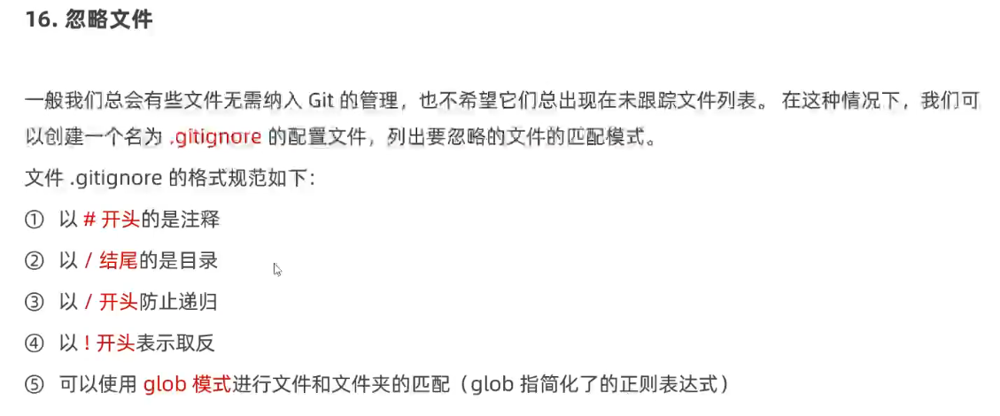
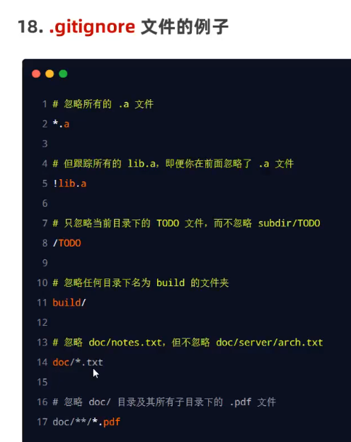

# Git常用命令

工作区→暂存区→本地库

**git add .** (有个点.)一次性添加多个

**git reset HEAD  文件名**(或.    .代表所有文件)  移除暂存区文件(**拉取最近一次提交到版本库的文件到暂存区  改操作不影响工作区**)

**HEAD** **可以理解为一个游标 一直指向当前我们所在版本库的地址 就是我们当前所在版本库的头指针**

当然 我们也可以不使用HEAD **可以直接使用版本库的地址 版本库地址 可以用** `git log` **命令打印出来**

git rm -f 文件名 删除工作区和暂存区

git rm --cached 文件名/目录 删除暂存区文件（工作区不删除）

git reflog 精简历史信息 git log 详细

版本穿梭（回退回指定旧版本）

# 分支的操作

git checkout 文件名 可以撤销对文件的修改 还原为仓库中的状态(**拉取暂存区文件 并将其替换成工作区文件**)

合并分支时，两个分支都修改了同一文件，导致git不知道以哪个版本为主，需要手动修改合并区域，保存

然后 add到暂存区，commit到本地库，commit时不能带文件名

跨团队协作：团队B fork 仓库（拉取）  pullrequest（推送）

# 远程仓库操作

**修改仓库**

**git remote set-url 远程仓库别名   地址**

clone代码不需要任何账号密码 

clone会做三件事：1、拉取代码   2、**初始化本地仓库**  3、创建远程仓库别名（**默认**origin）

git ssh登录，本地生成公钥私钥 公钥用来加密 私钥解密 将公钥配置到github设置

**思考**：不同的项目project可以建立不同的git repository ，在不同项目的本地工程目录下创建git本地仓库，设置不同的远程仓库链接（对应不同的repository，上传到不同库文件）

新文件还是需要先 add  只对修改或删除有用

忽略文件

