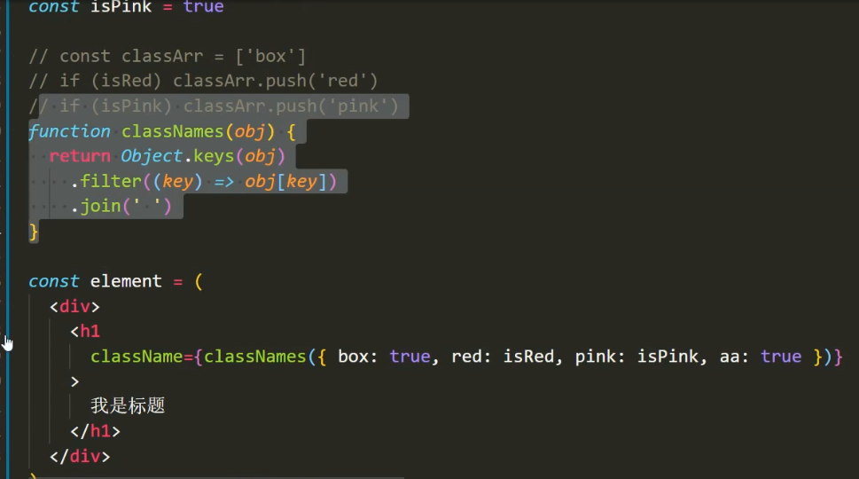
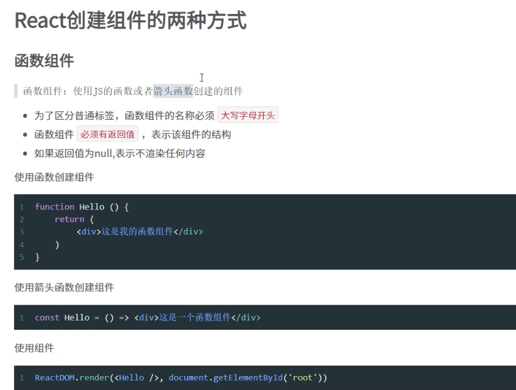

## React脚手架

非全局安装

用npx调用最新版本创建react项目返回

#### 创建dom

#### jsx

通过babel帮你把html格式转为react.createElement的形式

旧版reat还需要引入React

##### 注意事项

需要根节点，class改为classname，label的for改为htmlFor，有换行整个用()包裹

#### jsx {}嵌入js表达式

不能用if else for

## for循环

{}里可直接放置数组，将数组数组进行处理，包裹上虚拟dom标签后返回

## 样式

用双括号是因为，外层括号表示插值表达式，内层括号表示一个类

#### 自行封装类似vue的行内样式效果

将值为true的class类名，保留拼接到一起

className=xx 直接设置类名。

#### 可以用classnames库实现上述效果

## 组件

函数组件，名称大写开头，组件必须有返回值

## 类组件

## 添加状态(数据)

构造器中constructor添加state属性

#### 简写

因为一般不需要通过constructor传递初始化参数，可以直接声明实例属性state(class的语法)

## 事件处理

#### 事件注册

on+事件名，驼峰命名

#### 事件对象

通过参数e获取

#### this指向问题处理

通过上述方式，声明handleClick()方法，并在onClick上进行绑定，onClick={this.handleClick}

handleClick方法内若使用了this，会指向undefind，因为jsx中的事件绑定，不会帮你绑定函数的this指向，

调用时相当于 const fn=this.handleClick()，fn(),**直接调用fn时，this为undefined。**

注：render()函数内声明jsx的时候可以用this，this指向当前类组件没有问题。

解决方案：

一，绑定onClick时外面加一层箭头函数，onClick={()=>this.handleClick()},通过箭头函数的this特性给函数绑定  

​        this

二，通过bind绑定this，onClick={this.handleClick.bind(this)}

三，声明handle方法时，用实例方法+箭头函数的写法(class里声明方法，不写function直接写方法名为原型方法，声明变量名赋值为函数，为实例方法，不会挂载到原型)

class xxx{

  handleClick=()=>{this.xxxxxx}

}

## setState修改状态

且不能改动到原state的数据，只能覆盖

## 表单处理

#### 受控组件

表单内容受到state状态控制的组件，text ，text area，select，checkbox等

#### 受控组件onChange

受控组件，需要在标签上绑定onChange()事件，通过e.target获取目标元素和新值，将新值赋值给state

多个表单元素，可绑定同一个onchange回调函数，不同的表单控件声明不同的name属性，通过name属性设置判断对应的state并更新

#### es6属性名表达式

es5中，对象的value可以是表达式，如{a:1+1},但key不可以，

es6中，对象的key也可以是表达式，加上[ ]即可，如:{['a'+'a']:1},

通过属性名表达式的方式，可以用变量动态控制属性名：let name=xxxx, {[name]:123},name对应的值由变量值决定

#### 非受控组件-ref

通过React.createRef创建一个ref，绑定到jsx

## 组件通讯props

子组件，函数组件，通过参数接收，类组件，通过this.props接收

#### props特点

#### 父传子

#### 子传父

数据由父组件通过props传递给子组件，

由父组件定义修改数据的方法，将方法通过props传递给子组件

**注意：定义方法时，要使用箭头函数**，因为方法内通过this.setState()更新数据，只有使用箭头函数定义，才能保证方法内部的this指向父组件不改变。

#### 兄弟组件

状态提升

利用共同的父组件，父组件提供共享状态和操作状态的方法，通过props接收状态操作状态

#### 孙子组件-context

孙子组件层级多，通过父组件需要传递多个层级。使用context

使用react.createContext创建一组Provider和Consumer，

使用Provider标签包裹需要共享数据的子组件，Provider标签提供value属性，

通过export将Consumer导出，在孙子组件import consumer

注：Consumer要作为最外层包裹，包裹内容必须是一个函数，函数内部返回jsx，通过参数接收value值。

修改数据方法，和数据包装为对象通过value传递

#### props--children属性

用子组件包裹起来的内容，都可以在子组件内部通过props.children属性获得，类似于插槽

本质上还是props(props除了传递数据同样也能传元素甚至组件)

#### props传参类型校验 propType

react数据类型封装在prop-types，声明props校验时要先导入prop-types包

组件声明校验：

组件名.propTypes={}

添加的是类的静态属性，也可以在class内通过static关键字声明

##### 可校验的类型

#### 默认值

## 组件生命周期

只有类组件才有生命周期

constructor render componentDidMount

#### 挂载阶段

render里不能调用setstate，因为组件更新会调用render重新渲染，在render里调setstate造成死循环

#### 更新阶段

componentDidUpdate 同样不能调用setState

#### 卸载

componentWillUnmount

