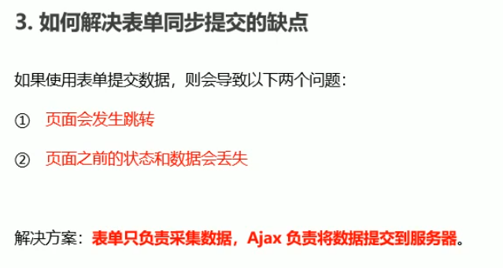
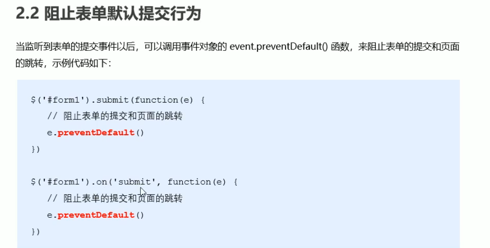
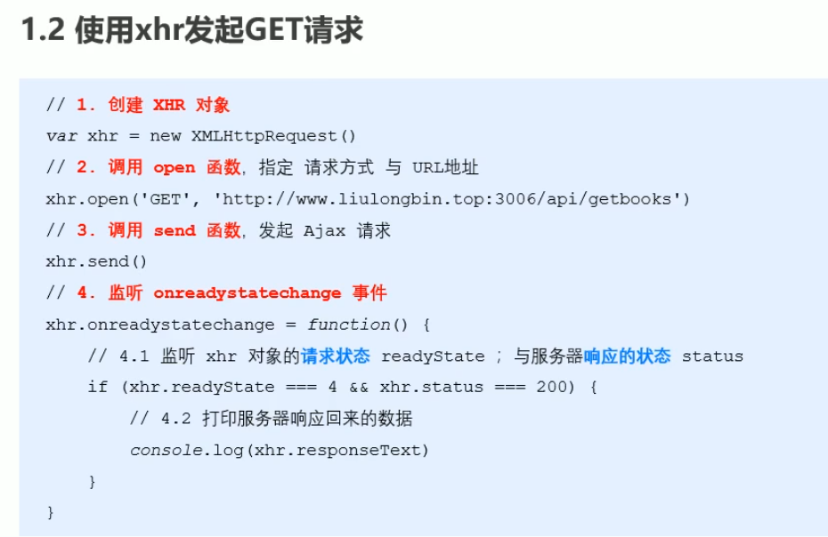
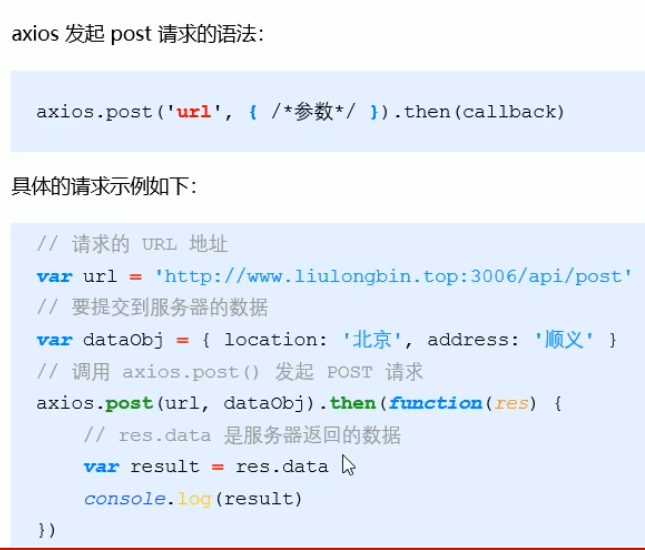
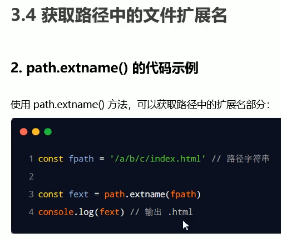
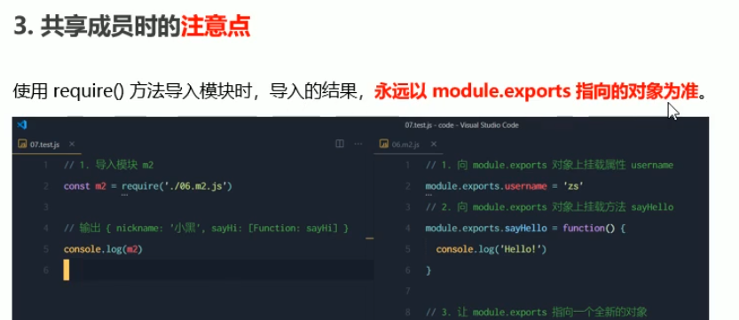

# Ajax

#### jQuery使用ajax

$.get()函数

post

$.ajax()

form表单

#### 表单同步提交的优缺点

阻止表单默认提交行为

#### 快速获取form表单数据

原生form表单，清空方法，form(获取dom).reset()

## 模板引擎

渲染UI结构时遇到的问题  字符串拼接麻烦

#### 模板引擎

#### art-template模板引擎

ifelse

以{{if}}开头  以{{/if}}结束   相当于双标签

循环输出

过滤器

例：

#### RegExpObjcet.exec(string)   

根据正则提取内容

### XMLHttpRequest

XMLHttpRequest的readyState属性

发起Get带参请求

#### post

json js互相转换

#### XMLHttpRequest Level2新特性

旧版缺点：

#### 新特性：

timeout超时

#### formdata对象管理表单数据

#### 用formdata对象获取网页表单值

#### 上传文件

#### 显示文件上传进度

xhr.upload.onprogress事件

监听完成上传事件

#### jQuery实现文件上传

## Axios

#### axios发起get请求

#### axios发起post请求

#### 直接发起请求

## 同源策略

协议(http/https)、域名、端口号(默认80)  相同，即同源，反之则是跨域

安全机制

#### 实现跨域请求 JSONP和CORS

 JSONP实现原理，通过script的src属性完成请求

#### jQuery中的JSONP

防抖 节流

防抖的具体实现，有立即执行版和非立即执行(区别在于第一次点击时，马上进行等待还是执行完方法再等待)

响应状态码

## Node.js基础

#### fs文件系统

#### fs.readFile（）

####  _ _dirname 当前文件所处目录

#### path路径模块

#### path.basename() 获取路径中的文件名

#### path.extname() 获取文件扩展名

#### 创建web服务器

#### res响应对象

res响应中文乱码问题

#### 模块

加载模块

模块作用域

好处：防止变量污染

#### 向外共享模块作用域中的变量   module对象

每个.js文件里都有一个module对象

module.exports对象

## npm

安装包

#### 用package.json记录项目使用到的包信息

package.json文件只能锁定大版本，即版本号的第一位，**不能锁定后面的小版本**，你每次npm install时候拉取的该大版本下面最新的版本

一般为了稳定性考虑我们不能随意升级依赖包，因为如果换包导致兼容性bug出现很难排查，所以**package-lock.json就是来解决包锁定不升级问题的**。

#### 快速创建package.json

#### 一次性安装所有包

#### 卸载包

#### devdependencies

切换下载源

#### nrm

包的分类

#### 定义自己的包

#### 模块加载机制

优先从缓存加载

内置模块

自定义模块

按目录加载    (先按上述文件名补全规则，再尝试目录加载)

第三方模块加载

