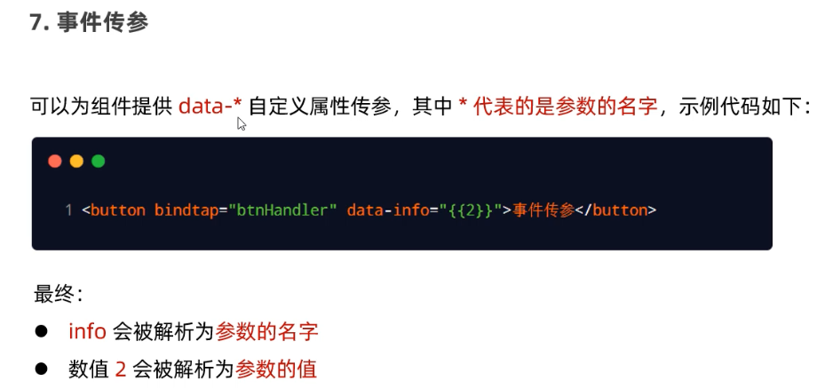
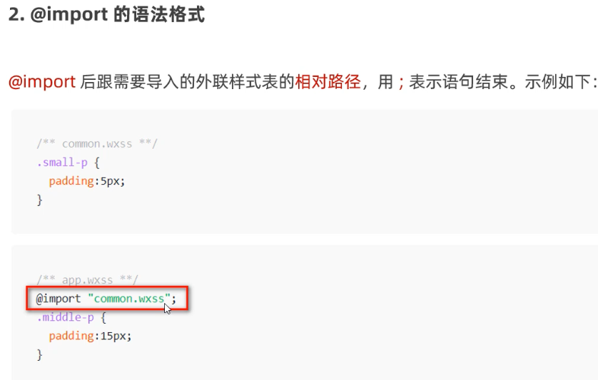
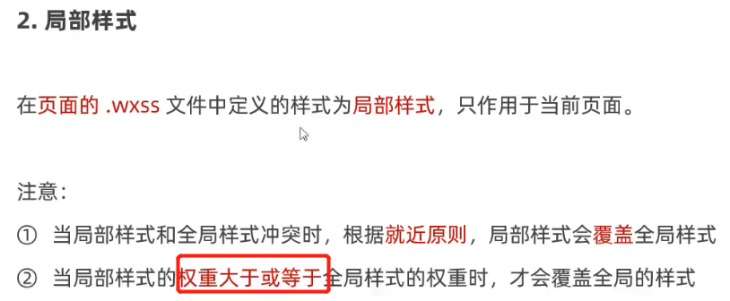
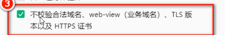
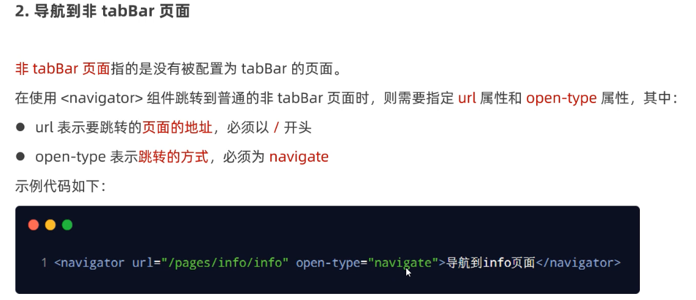
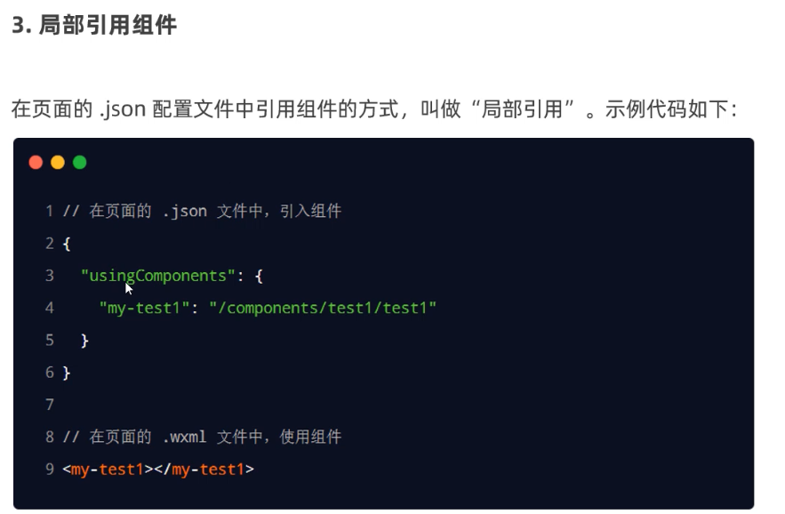
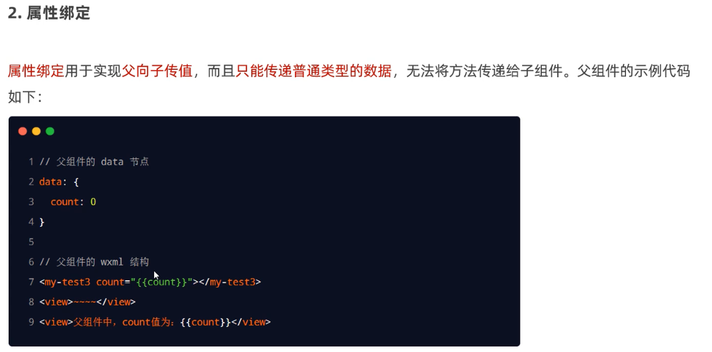
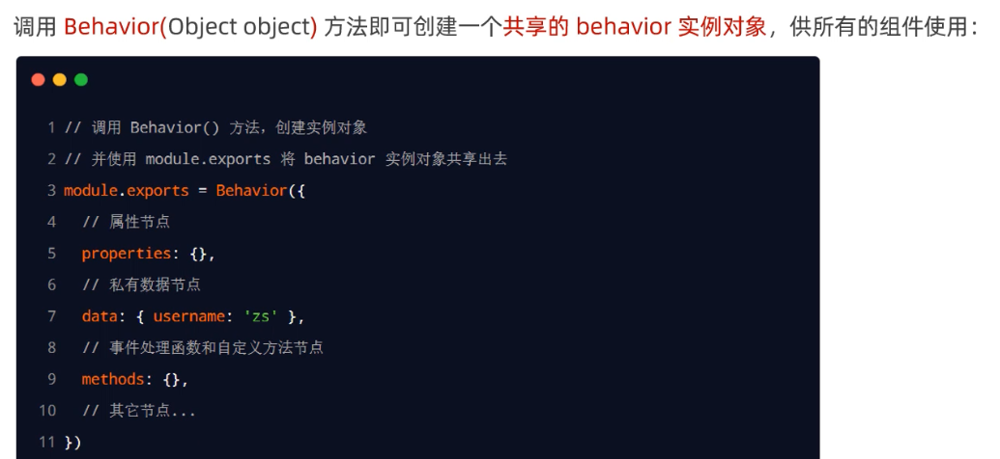
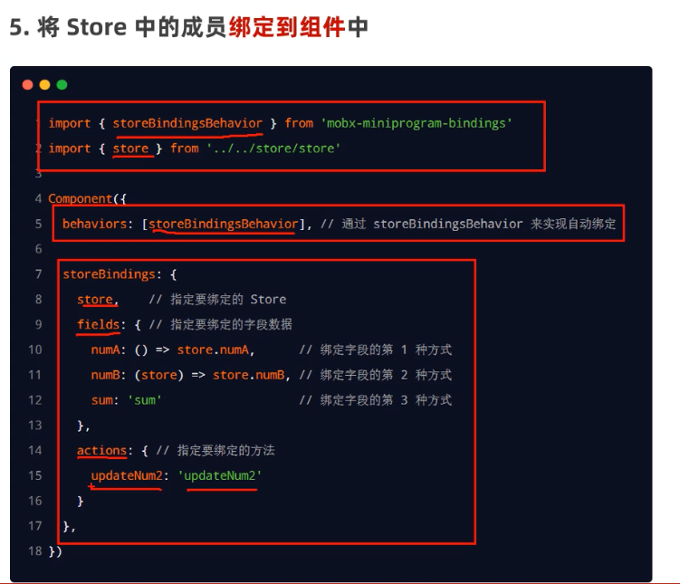

#### scroll-view


#### swiper


只有text包裹内容才支持长按选中


#### img


## 数据绑定


常用事件


事件对象的属性


#### data数据赋值  this.setData({属性名：xxx})


#### 事件传参

不能直接使用方法名(参数)的方式




bindinput


#### wx:if="{{}}"


#### <block>+wx:if 一次控制多个组件的展示与隐藏


#### hidden


#### wx:for


小程序上，所有屏幕宽度都为750rpx，1rpx相当于屏幕宽度的750分之1，一般设计稿都以二倍图为标准，二倍图宽度为750px，iphone6的物理像素为750，逻辑像素375，在物理像素和逻辑像素1:1的情况下，1px用1个物理像素显示，在iphone上则需要用更多的物理像素渲染1px，才能从视觉效果上跟1:1的屏幕相同，但也会更清晰(用了二倍图的情况)，因为图片细节更多。

为什么1rpx=0.5px,因为设计稿一般以iPhone6二倍图为标准即750px(750px是为了适应750的物理像素)，实际上量宽度的时候，以iphone6的逻辑像素即375px宽度来量，蓝湖等工具为了方便前端量尺寸，设置为2倍图时图片的宽度尺寸显示为375px（实际图片为了适应高物理像素用的是750px）,

iPhone6逻辑像素是375px，设定上750rpx为屏幕宽度(即不同设备1rpx为屏幕宽度750分之1)，那么以最常用的设计稿为标准750rpx=375px   1rpx=0.5px


#### WXSS @import






#### app.json 全局配置 -window


#### tarBar

2-5个tab页签


 

#### 全局配置-tarbar


list:[{},{}]


#### 页面配置和全局配置冲突时 就近页面配置

#### 页面配置常用配置项


#### 网络数据请求

1、只能https 2、接口域名添加到信任列表




#### get请求


#### post


### 声明式导航 navigator

#### 跳转到tabbar页


#### 跳转非tabbar页



#### 后退导航


#### 传参


### 编程式导航

#### 导航到tabBar


#### 非tabBar


#### 后退


#### 传参


#### 在onLoad中接收传参  可以挂载到data数据里


### 监听下拉刷新事件


### 停止下拉刷新 stopPullDownRefresh()


### 上拉触底函数 onReachBottom


### 上拉触底Loading效果 wx.showLoading


### 应用生命周期函数


### 页面生命周期函数


### WXS脚本


### 内嵌wxs脚本


### 外联wxs脚本


### 自定义组件

引用



全局引用，同上 在app.json声明


组件和页面区别


### 全局和组件样式隔离


#### 修改组件样式隔离选项


组件的方法要定义到methods节点里


### properties属性 接收外界传入组件的数据


### data和properties区别 (区别于vue 都是可读可写)

data和properties数据指向同一个对象


### 数据监听 observers


#### 监听对象属性变化


#### 监听对象所有属性


### 纯数据字段  (不需要用于页面渲染的字段，提升性能)


### 组件生命周期函数


#### lifetiems节点


#### 组件所在页面的生命周期


#### pageLifetimes节点


### 单个插槽


### 启用多个插槽


### 父子组件通信


#### 属性绑定




#### 事件绑定


#### 获取组件实例


### 组件间代码共享 behaviors (vue的mixins)


#### 创建behaviors



#### 导入behaviors


#### behaviors节点


### 使用npm包


### vant


定制样式    vant官网查看css变量名


### API Promise化


### 全局数据共享MobX (类似vuex)


#### 创建Store实例

在store.js


#### Store成员绑定到页面


#### Store成员绑定到组件



### 分包


### 独立分包


#### 分包预下载配置

进入某个页面时，预先下载该页面会用到的分包


## uniapp

#### 引入请求工具

```
import { $http } from '@escook/request-miniprogram'

uni.$http = $http
// 配置请求根路径
$http.baseUrl = 'https://www.uinav.com'

// 请求开始之前做一些事情
$http.beforeRequest = function (options) {
  uni.showLoading({
    title: '数据加载中...',
  })
}

// 请求完成之后做一些事情
$http.afterRequest = function () {
  uni.hideLoading()
}
```

#### 小程序轮播图swiper

```
<!-- 轮播图区域 -->
    <swiper :indicator-dots="true" :autoplay="true" :interval="3000" :duration="1000" :circular="true">
      <!-- 循环渲染轮播图的 item 项 -->
      <swiper-item v-for="(item, i) in swiperList" :key="i">
        <view class="swiper-item">
          <!-- 动态绑定图片的 src 属性 -->
          <image :src="item.image_src"></image>
        </view>
      </swiper-item>
    </swiper>
```

#### 配置分包

```
"subPackages": [
    {
      "root": "subpkg",
      "pages": []
    }
  ]
```

#### 小程序showToast

```
// 封装的展示消息提示的方法
uni.$showMsg = function (title = '数据加载失败！', duration = 1500) {
  uni.showToast({
    title,
    duration,
    icon: 'none',
  })
}
```

#### 获取系统信息，获取高度

```
// 获取当前系统的信息
      const sysInfo = uni.getSystemInfoSync()
      // 为 wh 窗口可用高度动态赋值
      this.wh = sysInfo.windowHeight
```

#### 通过easycom方式新建组件(无需导入和注册即可使用)


#### css3 position:sticky 吸顶

```
// 设置定位效果为“吸顶”
  position: sticky;
  // 吸顶的“位置”
  top: 0;
```

#### 数据持久化

```
uni.setStorageSync
```

#### 跳转

```
uni.navigateTo({
    url: '/subpkg/goods_list/goods_list?query=' + kw
  })
```

#### 小程序上拉触底加载功能和监听事件

```
{
         "path": "goods_list/goods_list",
         "style": {
           "onReachBottomDistance": 150
         }
       },
```

```
// 触底的事件
onReachBottom() {
  // 让页码值自增 +1
  this.queryObj.pagenum += 1
  // 重新获取列表数据
  this.getGoodsList()
}
```

#### 小程序下拉刷新加载功能和监听事件

```
{
    "path": "goods_list/goods_list",
    "style": {
      "enablePullDownRefresh": true,
      "backgroundColor": "#F8F8F8"
    }
```

```
// 下拉刷新的事件
onPullDownRefresh() {
  // 1. 重置关键数据
  this.queryObj.pagenum = 1
  this.total = 0
  this.isloading = false
  this.goodsList = []

  // 2. 重新发起请求
  this.getGoodsList(() => uni.stopPullDownRefresh())
}
```

#### 切换tab导航页

```
 uni.switchTab({
      url: '/pages/cart/cart'
    })
```

#### 设置tab导航标签的数字角标

```
 uni.setTabBarBadge({
         index: 2, // 索引
         text: this.total + '' // 注意：text 的值必须是字符串，不能是数字
      })
```

#### 小程序，调用微信选择地址功能chooseAddress()

```
// 1. 调用小程序提供的 chooseAddress() 方法，即可使用选择收货地址的功能
    //    返回值是一个数组：第 1 项为错误对象；第 2 项为成功之后的收货地址对象
    const [err, succ] = await uni.chooseAddress().catch(err => err)

    // 2. 用户成功的选择了收货地址
    if (err === null && succ.errMsg === 'chooseAddress:ok') {
      // 为 data 里面的收货地址对象赋值
      this.address = succ
    }
```

#### 小程序弹窗showModal

```
uni.showModal({
    content: '检测到您没打开地址权限，是否去设置打开？',
    confirmText: "确认",
    cancelText: "取消",
  })
```

#### 小程序openSetting进入授权页面(页面展示曾经弹出的授权申请，没有则为空)

```
 // 3.4 如果用户点击了 “确认” 按钮，则调用 uni.openSetting() 方法进入授权页面，让用户重新进行授权
  if (confirmResult.confirm) return uni.openSetting({
    // 3.4.1 授权结束，需要对授权的结果做进一步判断
    success: (settingResult) => {
      // 3.4.2 地址授权的值等于 true，提示用户 “授权成功”
      if (settingResult.authSetting['scope.address']) return uni.$showMsg('授权成功！请选择地址')
      // 3.4.3 地址授权的值等于 false，提示用户 “您取消了地址授权”
      if (!settingResult.authSetting['scope.address']) return uni.$showMsg('您取消了地址授权！')
    }
  })
```

scope是权限相关


#### 小程序@tap监听事件和getUserProfile获取用户个人信息

```
 @tap="getUserInfo"
 
 async getUserInfo(e) {
				const [exception,res]=await uni.getUserProfile({desc:'获取用户信息'}).catch(exception=>exception)
```

能获取微信昵称 头像等非重要信息

#### 小程序login()方法，获取用户凭证code

使用 code 换取 openid、unionid、session_key 等信息

#### 小程序requestPayment发起微信支付

微信支付流程：

通过微信提供的api，发送相应的数据，比如商家订单号、商户号、应用id、支付金额等，在微信端**生成预支付订单**，接口会返回预支付订单id，prepay_id。一般这个过程由后端完成，前端提供商品信息数量等订单信息，由后端向微信生成预支付订单，并将id返回给前端。

前端使用预支付id，时间戳，sign签名等数据(由后端返回)，调用小程序requestPayment API，发起支付请求。