默认存在


#### 二倍图

750像素图

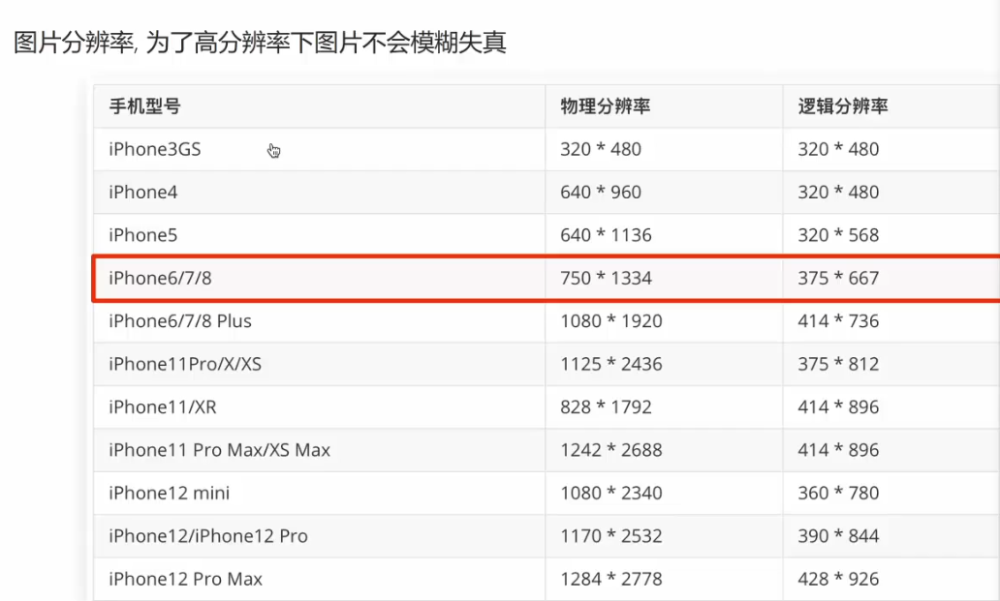

物理分辨率高，逻辑分辨率低时，表现出来的视觉效果就是图片被放大(参考windows系统,分辨率设置,屏幕为1920，系统设置的逻辑分辨率越低时图标越大,越模糊。)

图中iphone6/7/8的物理/逻辑像素比为2:1，即50x50的图片,在手机中会被放大为两倍即100x100,为了让图片不模糊,所以使用二倍图(一倍为375px,二倍为750px)

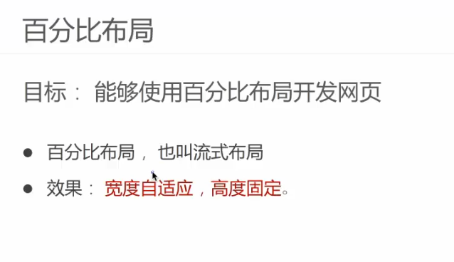

## Flex布局

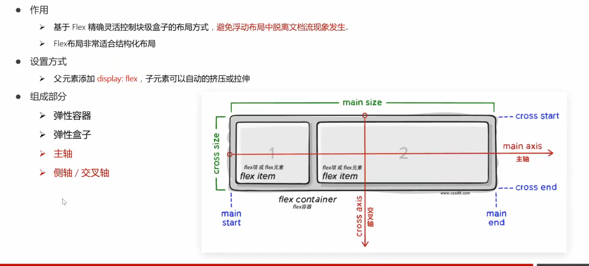

默认主轴在水平方向，弹性盒子延主轴方向排列


#### 主轴对**齐**方式(盒子的排列方式)

**justify-content**

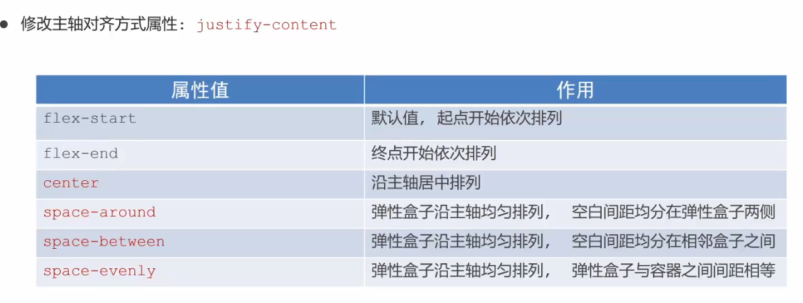

center：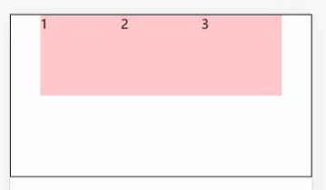    

around: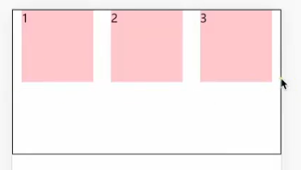

between: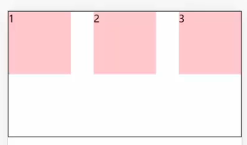


evenly:

## 侧轴对齐方式(排列方式)

align-items

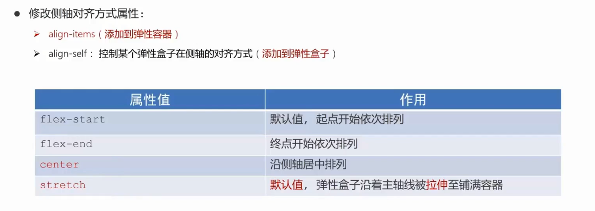

stretch为默认属性，子盒子不设置高度，默认拉伸占满父元素高度

子盒子不设置宽度，宽度为内容宽度。

子盒子单独设置了align-self，没有设置高度，则高度为内容的高度


## 伸缩比

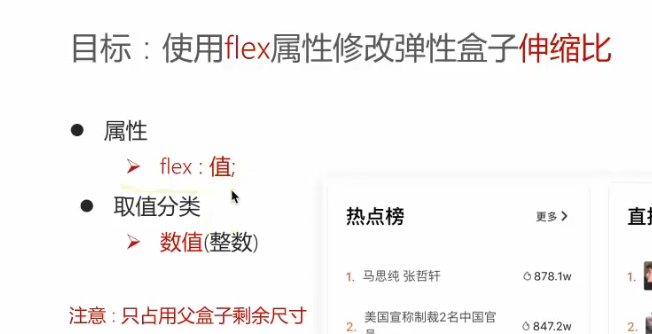


## Flex-修改主轴方向

flex-direction

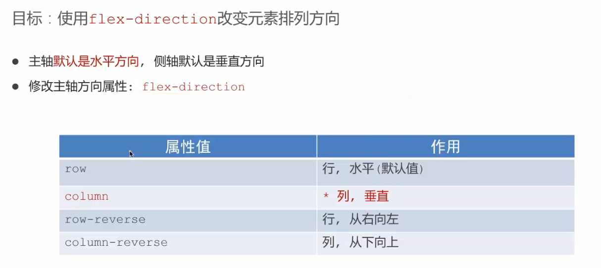

## 弹性盒子换行

flex-wrap：wrap；


#### 调整行对齐方式

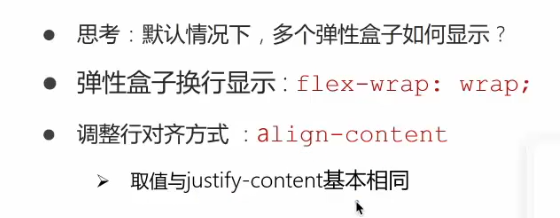


flex小技巧，文字溢出显示省略号


width设置盒子宽度，或直接设置为0，设置为0需要配合flex:1

设置flex:1，因为是弹性盒子(宽度会自动加大)，white-space:nowrap不换行，盒子会被撑大,overflow:hidden不起作用,所以设置width:0

#### **white-space属性**

white-space 属性设置处理元素内的空白，所谓空白有哪些？

**Space(空格)、Enter(回车)、Tab(制表符)**

我们熟知的是：

1. 在开发中，无论我们敲多少空格和回车，显示在页面上的都会合并成一个。
2. 我们的文字在超过一行的情况下，就会**自动换行**。


pre:原样输出指文本多少个空格页面就显示多少空格，有回车就换行，没有回车，超过时不换行

想要文字溢出的部分自动用省略号表示，那么离不开三个属性:

```
white-space: nowrap; /*强制内容在一行显示*/
overflow: hidden;/*超出部分溢出*/
text-overflow: ellipsis;/*溢出的部分使用省略号*/
```


## 移动适配

rem:单位


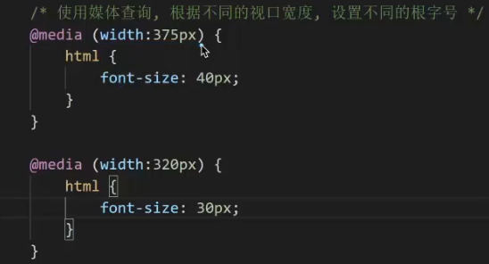


计算rem

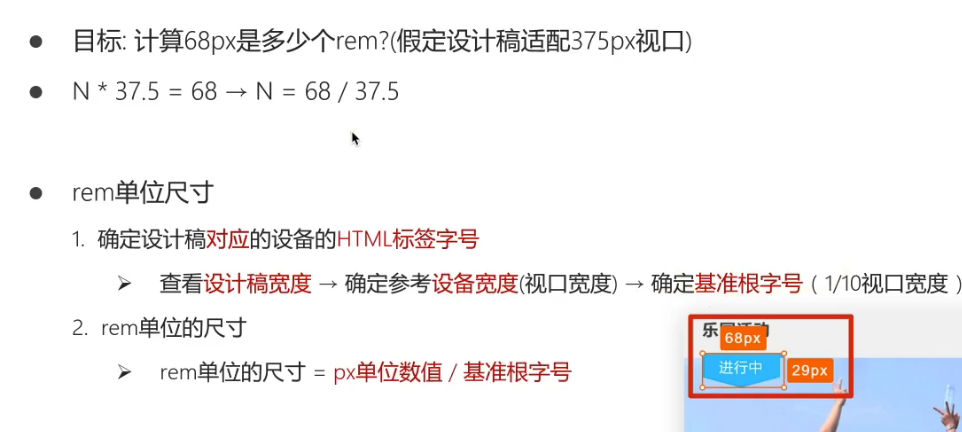

#### 使用flexible.js代替手动写媒体查询


个人理解：

首先要拿到设计稿本身是相对哪个屏幕宽度设计的，假设以375宽度设计,font-size设计为对应的屏幕宽度除以10，本质上是把手机屏幕分为10份，以设计稿所量尺寸除以÷font-size(当前屏幕宽度的1/10),得到的rem值本质上可以理解为该尺寸占10等份中1份的比例。换设备后,屏幕宽度不同,但是font-size是由新的屏幕宽度决定的(屏幕宽度的十分之1)，由rem值(其实相当于百分比占比)乘以新的font-size，得到的该设计图在另一屏幕对应的具体尺寸，因为是按相同的屏幕占比计算得到，所以该部分的内容在不同的屏幕设备上会有自适应的效果。

为什么不直接写百分比%值？可能是因为百分比值是相对于父元素计算的，虽然计算可以通过less去计算，但是写起来复杂，盒子嵌套很多，比如写padding时百分比对应的宽度是盒子内部的宽度，而写margin时则对应的是父元素的宽度。其二是因为height默认是0,高度由内容撑开,直接写百分比%值不能很好的设定height值。

为什么上述font-size设定为屏幕宽度➗10？其实可以是别的值，flexible.js设定的应该是10，所以按10来算。


## Less

#### 注释

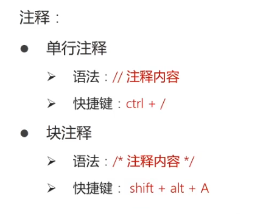


#### 计算

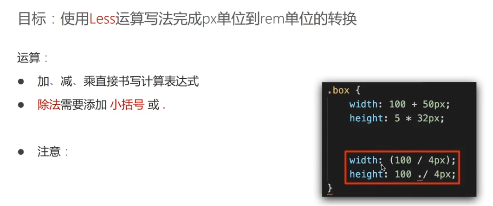


#### 嵌套-后台选择器

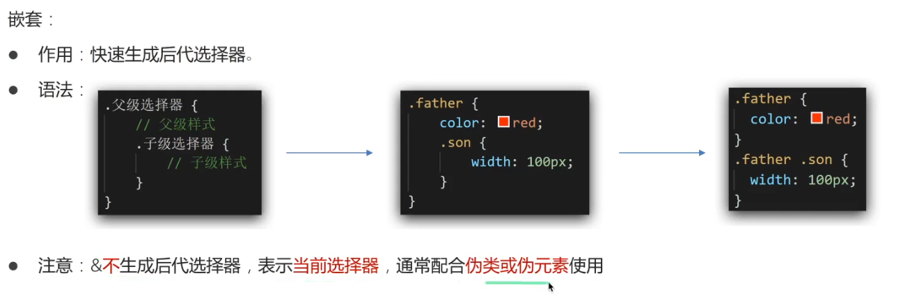


#### 变量

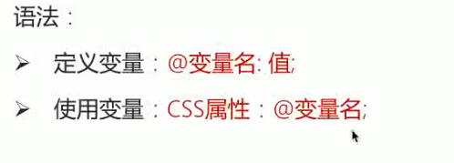


#### Less导入

导入其他less文件写的样式


