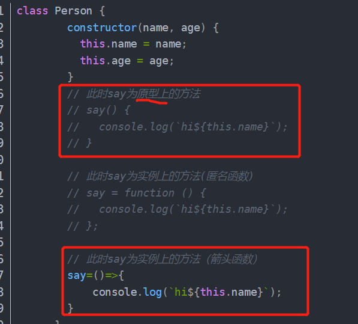
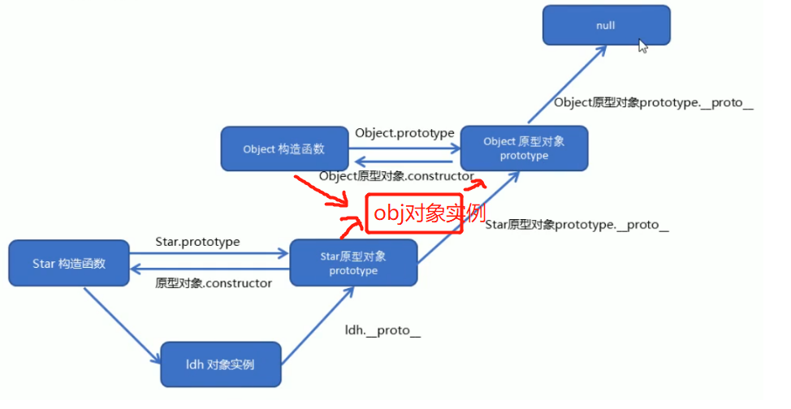

#### 类的声明&&对象创建

.assets/1635779797900.png)

#### 类的继承

.assets/1635858402215.png)

注意点

.assets/1635859342298.png)

#### class里声明原型方法和实例方法

constructor方法外，直接声明的方法，如：test(){} 为原型方法(**不需要在前面加function**)，挂载到原型对象上

通过匿名函数赋值或者箭头函数赋值的方法为实例方法，存在于实例内部。

也可以在constructor内，通过this.xx=()=>{}声明实例方法




#### .insertAdjacentHTML()

.assets/1635868720465.png)

.assets/1635868794854.png)


.assets/1635946535926.png)


#### 类 实例成员和静态成员

.assets/1635947965843.png)


#### 原型prototype

.assets/1636121553754.png)


.assets/1636206117613.png)

.assets/1636207099963.png)

.assets/1636207455348.png)

#### 原型链

.assets/1636209218297.png)




#### JavaScript成员查找机制

.assets/1636209935094.png)

this指向

.assets/1636210125386.png)

#### 利用原型扩展内置对象自定义方法

.assets/1636211494265.png)


## ES6的类继承和ES5有什么区别？

1、**使用上的区别**

ES6通过class声明类，extends声明继承关系(本质上也是通过原型链)，es5通过手动设置原型对象完成继承关系

2、**声明的class不能当作普通函数调用**

es5用function声明的类可以当作普通函数调用，而class只能通过new的方式调用

调用时构造函数时会进行判断，传入this，和构造函数，使用new操作，new会先创建一个对象，然后用call调用构造函数，this指向为新对象。所以用new操作时，下列方法才能够校验通过不抛出异常。

instanceof检测右边构造函数的prototype对象在不在左边对象的原型链上

.assets/1652349280916.png)

3、**ES6声明的class类对象的原型方法和静态方法不可枚举，es5的可以**

原因：ES6在创建对象时，用`Object.defineProperty`方法来设置原型方法和静态方法，而且`enumerable`默认为`false`(不可枚举)，Object.defineProperty()三个参数，1是目标对象，2是目标对象的属性名，3是相关配置项(通过对象类型传入)，

相关配置项有writable：是否可重写 value：当前值   get：读取时内部调用的函数set：写入时内部调用的函数

enumerable：是否可以遍历  configurable：是否可再次修改配置项

4、**es6的类实际上有双原型链，通过类上的_proto_属性完成静态方法和静态属性继承**

es5继承静态方法和静态属性，是直接遍历添加到子类上

而es6，将子类的_proto属性指向了父类，因为函数也是对象，自身没有的属性和方法也会沿着`__proto__`链查找。从而完成静态方法继承

另一条链和原先一样，子类实例_proto属性指向原型对象，原型对象proto属性往上指向父类原型对象

5、**ES6继承是先用父类的构造函数创建了父类的实例(拥有了父类的属性和方法)**，再把实例对象的‘_proto属性指向了子类的原型对象，此时该对象就变成子类的实例，然后再往该对象添加子类自身的属性方法，并且将子类的this指向该对象。这也是为什么在es6子类要先调用super()方法才会有自己的this

而es5是先创建子类的对象，用子类的对象调用父类的构造方法给自己添加属性完成父类属性的继承

.assets/1652353445987.png)

## ES6子类继承内部实现流程

1、判断是否new调用，非new调用抛出异常

2、创建子类原型对象，原型对象-proto-属性指向父类原型对象，完成继承关系设置

3、设置第二条原型链，子类-proto-属性指向父类，因为函数也是对象，自身没有的属性和方法也会沿着`__proto__`链查找。从而完成静态方法继承(es5没有)

4、通过父类构造函数创建实例，将实例-proto-属性指向子类原型对象(正常父类实例指向的是父类原型对象)，此时可以认为该实例已经是子类的实例，再往实例添加子类自身属性。最后在子类的构造函数中返回的是该实例。

es5是先创建子类实例，再用子类实例调用父类构造函数给自身添加属性

.assets/1652353445987.png)

https://blog.csdn.net/sinat_33488770/article/details/119960670?utm_medium=distribute.wap_relevant.none-task-blog-2~default~baidujs_baidulandingword~default-1-119960670-blog-119707813.wap_blog_relevant_default&spm=1001.2101.3001.4242.2&utm_relevant_index=4


## call()

可以改变函数的this指向

#### 使用call，利用父构造函数继承属性

子构造函数内部使用父构造函数调用call，改变父构造函数的this指向

.assets/1636269757507.png)

#### 利用原型对象继承方法

.assets/1636273496671.png)

由于子类原型对象prototype指向了父类对象(实例),所以也拥有了父类定义的方法，父类对象的_proto_属性指向父类的原型对象,所以也拥有了父类原型对象上绑定的方法


## es5新增数组方法

foreach循环

.assets/1636274862107.png)

filter()筛选

.assets/1636274882457.png)

filter(value=>value)可以剔除undefined内容


some() 查找是否有满足元素 (返回true or false)

.assets/1636275292759.png)

####  foreach和some区别  foreach里return不会终止函数运行(会继续迭代)

.assets/1636276219660.png)

#### trim() 去掉字符串左右空格(中间空格不会)


#### Object.keys()获取对象属性名

类似for..in(for(key in array))

.assets/1636276660475.png)


#### Object.defineProperty() 重新定义新属性或修改原有属性

.assets/1636279546155.png)

configurable:false 不允许修改特性，特性指上述4个参数的设定

.assets/1636279645941.png)


#### 函数的定义方式

.assets/1636280528978.png)

.assets/1636280543128.png)


#### 三种改变this指向

call() apply() bind()

.assets/1636284914343.png)

传递参数必须以数组形式

.assets/1636287662553.png)

#### bind（） 绑定

不会调用函数

.assets/1636287864276.png)

.assets/1636287894122.png)

 .assets/1636289726538.png)

for循环给按钮绑定事件

.assets/1636289806400.png)


总结

.assets/1636290591374.png)


#### 严格模式

strict mode

#### 整个脚本开启严格模式

.assets/1636290871827.png)

或

.assets/1636290978812.png)

#### 函数内部开启严格模式

.assets/1636291033781.png)

#### 严格模式带来的变化

.assets/1636291657234.png)

.assets/1636298767615.png)

.assets/1636298803255.png)


#### 高阶函数

.assets/1636376532342.png)

#### 闭包

一个作用域内访问另外一个函数的局部变量

如下，返回一个函数时，num不会被立即销毁，因为返回的函数需要访问到该变量

.assets/1636378557692.png)


.assets/1636381089191.png)


#### 浅拷贝&&深拷贝

拷贝一层，内层msg只拷贝了引用地址

.assets/1636383629345.png)

.assets/1636383677852.png)

Object.assign（target,...sources） 浅拷贝方法


#### 深拷贝 

.assets/1636383993162.png)

对象[key] 访问或添加对象的key属性


## 正则表达式

#### 创建正则表达式

.assets/1636463388987.png)

#### RegExpObject.test(*string*)

test() 方法用于检测一个字符串是否匹配某个模式.

如果字符串中有匹配的值返回 true ，否则返回 false。

.assets/1636463410494.png)

#### ^ $ 边界符

.assets/1636464420188.png)

.assets/1636464432229.png)

【】符号

.assets/1636464696866.png)

.assets/1636464712125.png)

中括号【】里加^  即【^】表示取反

#### 量词符

.assets/1636464982418.png)

 .assets/1636465640384.png)

#### 量词设定某个模式出现的次数

.assets/1636465980087.png)


#### 预定义类

.assets/1636466275340.png)

#### replace()  正则表达式替换

.assets/1636467511429.png)

.assets/1636467600357.png)


## ES6

let关键字  块级作用域

.assets/1636468851641.png)

.assets/1636468899611.png)

解决for循环用var声明变量的bug

.assets/1636470770321.png)

**为什么在for循环里用let声明，每个i值会有单独的块级作用域？**

​        猜测，**JS引擎**在let的情况下，每次循环自己都创建了一个块级作用域并塞到了for循环里(毕竟子作用域里没用let)，所以才有了三次循环三个独立的块级作用域以及三个独立的 i。(js引擎对for循环内的let值进行的处理)

.assets/1636471755583.png)

改用**引用对象**可以证实上述猜测

.assets/1636471842057.png)

.assets/1636472874183.png)


#### var只有函数作用域，带来的问题

因为没有块级作用域 if内部的tmp变量会提升到函数内的顶部声明，即console上面，所以输出为undefined


#### const关键字 声明常量  同样具有块级作用域

.assets/1636472690416.png)

.assets/1636472901929.png)


#### 解构赋值

.assets/1636473097145.png)

对象解构

.assets/1636473538887.png)

.assets/1636473624224.png)

#### 箭头函数

.assets/1636548963206.png)

形参一个，省略括号

.assets/1636549060299.png)

.assets/1636549941523.png)

.assets/1636551094736.png)

#### ES6中箭头函数加不加大括号的区别

箭头函数后面没有加大括号并且只有一行代码返回，是会默认return的；
而箭头函数后面加了大括号，则不会默认return

#### 剩余参数

...

.assets/1636552421884.png)

剩余参数和解构配合使用

.assets/1636552471104.png)


#### Array扩展方法

#### 扩展运算符

三个点 ...

.assets/1636552731592.png)


.assets/1636552793087.png)

#### 用扩展运算符合并数组

.assets/1636552934248.png)

#### 将类数组或可遍历对象转换为数组

.assets/1636553169640.png)

##### Array.from

将类数组对象(有length属性，其他属性名为0，1，2...)

.assets/1636553612053.png)

.assets/1636553665979.png)

要将一个类数组对象转换为一个真正的数组，必须具备以下条件：

　　1、该类数组对象必须具有length属性，用于指定数组的长度。如果没有length属性，那么转换后的数组是一个空数组。

　　2、该类数组对象的属性名必须为数值型或字符串型的数字

　　ps: 该类数组对象的属性名可以加引号，也可以不加引号

##### Array.from() 第二个参数

.assets/1636553790711.png)


#### Array.find()

.assets/1636553945502.png)

#### Array.findIndex（）

.assets/1636554235976.png)

#### Array.includes（）

.assets/1636554354421.png)

#### 模板字符串

用**反引号**定义``（Esc下面的键）

.assets/1636554725286.png)

模板字符串可以换行(普通子符串要加转义符)

.assets/1636554756434.png)

模板字符串调用函数

.assets/1636554874633.png)


#### String.startWith（） 和 endsWith（）

.assets/1636555021665.png)


#### String.repeat() 将原字符串重复n次，返回新字符串

.assets/1636555122899.png)

#### Set数据结构  不存储重复值

.assets/1636555295882.png)

#### 利用set做数组去重

.assets/1636555425268.png)


#### set方法、

.assets/1636555472291.png)

#### Set遍历 .forEach

.assets/1636555583401.png)

#### 取对象值时加上? 如:obj.name?.value

obj对象的name属性不存在时，obj.name 不会报错 输出undefined ,但obj.name.value会报错

可以写为obj.name&&obj.name.value

es6写法为obj.name?.value


#### 变量前+号 如 ：+a

if (+value >= distance) {
这个+什么意思

可以理解为

```
Number(value)
```

会将其按照Number函数的规则转换为数值或者NaN,规则大概如下：

- Boolean:true返回1，false返回0
- 数据值，直接返回
- null，返回0
- undefined，返回NaN
- 对于字符串，**将其转换为十进制数值**，会忽略前面的0（16进制除外），空字符串返回0，浮点数会返回浮点数值。其他格式字符串（无论是否数字开头，返回NaN，字符串中好几个小数点，返回NaN）